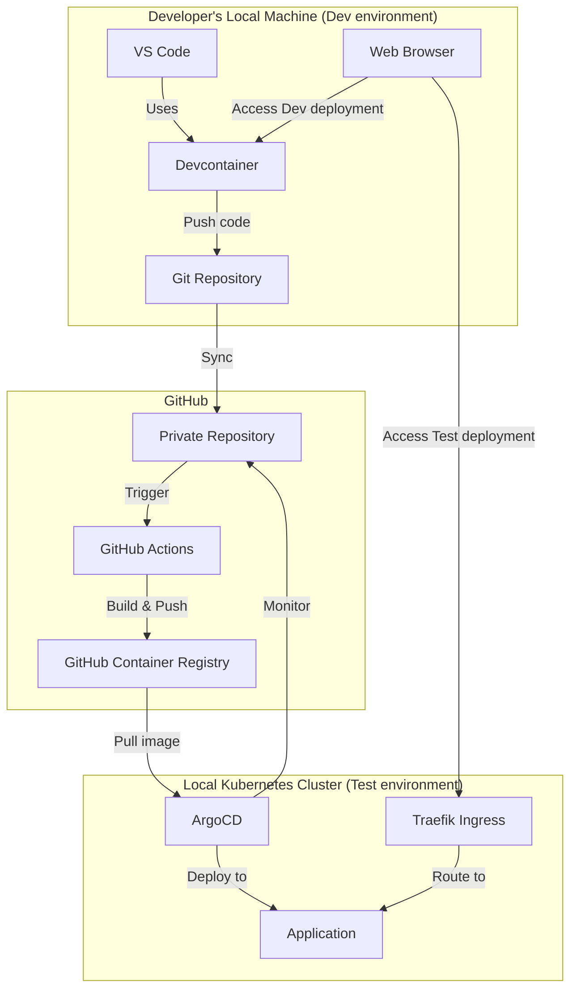
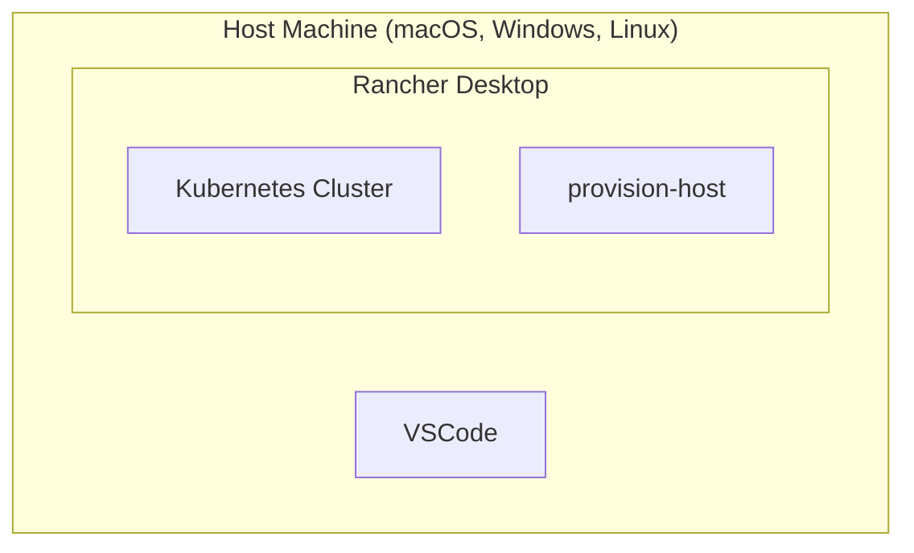

# Urbalurba-infrastructure Developer Platform

## Executive Summary

The urbalurba-infrastructure provides the stuff needed to make development fun and easy for developers.

It provides a development platform that developers can use to develop, test and deploy their systems without deep knowledge about undelyting infrastructure like kubernetes, GitOps and other facy terms.

A developer should be free to write code and not worry about the underlying infrastructure.

Urbalurba-infrastructure sets up a local kubernetes cluster that follow the latest GitOps principles and provides a set of tools that makes it easy to develop, test and deploy applications.
Providing a seamless developer experience consistent with latest tooling and workflows.

## Case: Red Cross Norway volunteer developer platform

The Norwegian Red Cross supports over **40,000 volunteers** across **380+ local branches**, many of whom have technical skills and see opportunities for IT improvements. This solution creates a streamlined path for these volunteers to develop, test, and contribute IT solutions that can ultimately be adopted by the organization, enabling a better flow from volunteer innovation to organizational adoption.

Among these volunteers are **programmers and software engineers** who participate in roles like "Besøksvenn" or "Nattvandrer". Through their firsthand experience, they see how **IT systems can improve daily operations and volunteer effectiveness**.

However, the Red Cross currently lacks a structured way to **receive, evaluate, and integrate** the IT solutions these volunteers develop. When a volunteer creates something that solves a real problem locally, there's no streamlined way for the IT department to bring that solution into production. This results in a **loss of value** for the organization and **frustration** for both the volunteers and IT staff. What begins as a solution becomes a problem—simply because we don't have the infrastructure to receive and adopt it.

This document describes a solution: a **local development platform and workflow** that allows volunteers and developers—whether internal or external—to contribute effectively and securely.

### Benefits

#### For Volunteers and Developers

- **Lower barrier to entry** for technical volunteers and new developers
- **Self-service setup** that reduces onboarding time
- **Fast feedback** through local testing and deployment
- **Familiar tools** like VS Code, GitHub, and modern frameworks
- **Production-like environment** for testing applications

#### For Red Cross IT Department

- **Predictable and maintainable** application structure
- **Standardized project templates** that follow best practices
- **Seamless handover** of code from volunteers to IT staff
- **Scalable model** that supports multiple projects and contributors
- **Reduced integration overhead** when adopting volunteer-created solutions

#### For the Organization

- **Harness volunteer technical skills** more effectively
- **Accelerate innovation** from field operations to organization-wide solutions
- **Improve volunteer experience** by providing professional-grade tools
- **Ensure security and compliance** through standardized infrastructure
- **Enable collaboration** between volunteers, staff, and external partners

### Conclusion

By providing a simple, flexible, and powerful local development setup, the Norwegian Red Cross can harness the technical skills of its volunteers and staff to build better systems. With GitOps and Kubernetes as the foundation, and with automation and templates smoothing the path, we can ensure that good ideas from the field don't get lost—they get adopted, improved, and brought into production.

This platform enables collaboration, learning, and innovation—and most importantly, helps support volunteers more effectively as they help others. The ArgoCD integration creates a seamless development experience for Red Cross developers and volunteers, allowing them to focus on building valuable solutions instead of dealing with complex infrastructure.

The GitOps approach ensures consistent, automated deployments while the scripted setup minimizes the learning curve. By implementing this strategy, the Red Cross platform will meet the goals outlined in the project overview: enabling volunteers to contribute effectively, providing a consistent development environment, and ensuring that good ideas can be quickly brought into production.

## Technical Details

### Templates

The template types are:

- **Backend Templates**: These are the basic templates that demonstrates how to use backend services like databases, message queues, serverless functions, object storage etc.
- **Application Templates**: These are templates that are used to create a web applications.
- **API Templates**: These are templates that requests data from APIs.

### Backend Templates

| Template Name | TypeScript | Python | Java | C# | Go | PHP |
|--------------|------------|--------|------|----|----|-----|
| **[Basic Web Server](templates/typescript-basic-webserver/README-typescript-basic-webserver.md)** | ✅ | ✅ | ✅ | ✅ | ✅ | ✅ |
| **Simple Database Integration** | 🔄 | 🔄 | 🔄 | 🔄 | 🔄 | 🔄 |
| **Database Integration** | 🔄 | 🔄 | 🔄 | 🔄 | 🔄 | 🔄 |
| **Message Queue** | 🔄 | 🔄 | 🔄 | 🔄 | 🔄 | 🔄 |
| **Serverless Functions** | 🔄 | 🔄 | 🔄 | 🔄 | 🔄 | 🔄 |
| **Object Storage** | 🔄 | 🔄 | 🔄 | 🔄 | 🔄 | 🔄 |
| **Application logging** | 🔄 | 🔄 | 🔄 | 🔄 | 🔄 | 🔄 |

### Application Templates

| Template Name | Designsystemet | TypeScript | React  | Storybook | NextJs | Strapi CMS | Okta authentication |
|---------------|----------------|------------|--------|-----------|--------|------------|------|
| **[Basic React App](templates/designsystemet-basic-react-app/README-designsystemet-basic-react-app.md)** | ✅ | ✅ | ✅ |  |  |  |  |
| **Basic NextJs App** | 🔄 | 🔄 | 🔄 | 🔄 | 🔄 |  |  |

### API Templates

| Template Name | TypeScript | Python | Java | C# | Go | PHP |
|--------------|------------|--------|------|----|----|-----|
| **Red Cross Norway Organization API** | 🔄 | 🔄 | 🔄 | 🔄 | 🔄 | 🔄 |

### Template Features

| Template Name | Features | Description |
|--------------|----------|-------------|
| **Basic Web Server** | • Web page<br>• Local dev<br>• K8s deploy | A simple web server template that includes:<br>• Displays template name, current time, and "Hello World"<br>• Development setup for local development<br>• Automatic deployment to local [Kubernetes cluster](https://www.rancher.com/products/rancher-desktop) |
| **Simple Database Integration** | • [SQLite](https://www.sqlite.org/)<br>• CRUD<br>• K8s deploy | Templates that include:<br>• [SQLite](https://www.sqlite.org/) database integration<br>• Create, Read, Update, Delete operations<br>• Development setup for local development<br>• Automatic deployment to local [Kubernetes cluster](https://www.rancher.com/products/rancher-desktop) |
| **Database Integration** | • [Postgres](https://www.postgresql.org/)<br>• CRUD<br>• K8s deploy | Templates that include:<br>• [PostgreSQL](https://www.postgresql.org/) database integration using local [Kubernetes cluster](https://www.rancher.com/products/rancher-desktop)<br>• Create, Read, Update, Delete operations<br>• Development setup for local development<br>• Automatic deployment to local [Kubernetes cluster](https://www.rancher.com/products/rancher-desktop) |
| **Message Queue** | • [Dapr](https://dapr.io/)<br>• Service-independent<br>• K8s deploy | Templates that implement:<br>• [Dapr](https://dapr.io/) integration with [RabbitMQ](https://www.rabbitmq.com/) in local [Kubernetes cluster](https://www.rancher.com/products/rancher-desktop)<br>• Service-independent messaging (RabbitMQ, Kafka, Azure Service Bus, etc.)<br>• Development setup for local development<br>• Automatic deployment to local [Kubernetes cluster](https://www.rancher.com/products/rancher-desktop) |
| **Serverless Functions** | • [Knative](https://knative.dev/)<br>• Auto-scale<br>• K8s deploy | Templates that implement:<br>• [Knative Functions](https://knative.dev/) for serverless execution<br>• Automatic scaling and event-driven architecture<br>• Development setup for local development<br>• Automatic deployment to local [Kubernetes cluster](https://www.rancher.com/products/rancher-desktop) |
| **Object Storage** | • [MinIO](https://min.io/)<br>• S3-compatible<br>• K8s deploy | Templates that implement:<br>• [MinIO](https://min.io/) object storage in local [Kubernetes cluster](https://www.rancher.com/products/rancher-desktop)<br>• S3-compatible API for file operations<br>• Development setup for local development<br>• Automatic deployment to local [Kubernetes cluster](https://www.rancher.com/products/rancher-desktop) |
| **[Basic React App](templates/designsystemet-basic-react-app/README-designsystemet-basic-react-app.md)** | • [Designsystemet](https://designsystemet.no/)<br>• [React](https://react.dev/)<br>• [Vite](https://vitejs.dev/)<br>• K8s deploy | Templates that implement:<br>• [Designsystemet](https://designsystemet.no/) components<br>• [React](https://react.dev/) for building user interfaces<br>• [Vite](https://vitejs.dev/) for development<br>• Development setup for local development<br>• Automatic deployment to local [Kubernetes cluster](https://www.rancher.com/products/rancher-desktop) |

### Legend
- ✅ Available
- 🔄 Planned

## Architecture Overview



### Key Components

- **VS Code + Devcontainers**: Provides a consistent development environment for application code
- **Rancher Desktop**: Delivers local Kubernetes clusters for developers
- **ArgoCD**: Handles GitOps-based deployment of applications
- **Traefik**: Ingress controller pre-installed in the cluster for routing
- **GitHub Actions**: Automated CI/CD pipelines for building and pushing container images
- **GitHub Container Registry**: Storage for container images
- **provision-host**: Utility container with administrative tools for configuration

## Urbalurba-infrastructure Setup

Installing the `urbalurba-infrastructure` repository and setting up the local development environment is a one-time process. This is done by running a script that sets up the local Kubernetes cluster and installs all necessary tools in a container.



### 1. Install Rancher Desktop

- Developer installs Rancher Desktop on their local machine
- This provides the Kubernetes cluster and container runtime needed for local development

### 2. Clone Infrastructure Repository

- Developer clones the `urbalurba-infrastructure` repository
- One script sets up a kubernetes cluster with tools and services needed to develop and deploy applications.
- An utilities container `provision-host` for managing the local cluster and providing administrative tools.
- No code or programs are installed you your local machine, all needed tools are installed in the container. Everyone has the same setup, and the setup is the same on all platforms (macOS, Windows, Linux).

### 3. GitHub Authentication Setup

Before developing applications for the platform, you need to set up GitHub authentication. This is required for repository access and container image management (ArgoCD needs it to deploy to the local cluster).

You'll need a GitHub Personal Access Token with appropriate permissions:

1. Go to [GitHub's Personal Access Tokens page](https://github.com/settings/tokens)
2. Click "Generate new token" → "Generate new token (classic)"
3. Name your token in the Note: field "Urbalurba Infrastructure"
4. Expiration: Select "No expiration" (or preferably a suitable expiration date)
5. Select scopes: `repo` and `write:packages`
6. Click "Generate token" and copy it immediately (it will only be shown once)

For detailed instructions, see the [official GitHub documentation](https://docs.github.com/en/authentication/keeping-your-account-and-data-secure/managing-your-personal-access-tokens#creating-a-personal-access-token-classic).

Keep the token secure and do not share it with anyone. It is used to authenticate your GitHub account and access your repositories.

The token is used by the UIS platform to authenticate with GitHub when registering private repositories with ArgoCD.

## Setting up for local development

### Initiating a new project

This step is done once for a new project.

#### 1. Create GitHub Repository

- Developer creates a new private repository in GitHub and clones it to their local machine.
- Just like any other GitHub repository, this is where the code will be stored and versioned.

#### 2. Setup Developer Toolbox

The developer-toolbox is a set of tools for development of various applications. With this you can develop Python, JavaScript/TypeScript, C-sharp etc. It uses devcontainer so that everyone has the same setup, and the setup is the same on all platforms (macOS, Windows, Linux).
See [https://github.com/norwegianredcross/devcontainer-toolbox](https://github.com/norwegianredcross/devcontainer-toolbox) for more information.

- Developer runs a script that sets up the developer-toolbox. It sets up devcontainer and installs all the tools needed for development.
- Developer starts VS Code and pushes an initial commit to GitHub
- This verifies that the basic Git setup is working properly

#### 3. Select Project Template

- Inside the devcontainer, developer runs `.devcontainer/dev/dev-template.sh`
- This allows them to select an appropriate template for their project type. Eg `typescript-basic-webserver`, `python-basic-webserver`, etc.
- The script sets up the project structure, Kubernetes manifests, and GitHub Actions workflows

#### 4. Local development environment

- Developer runs the project template locally to verify it works correctly.
- This ensures the development environment is properly configured
- Developer can itterate on the code and test it locally just like any other development setup.

#### 5. Push app to GitHub / test environment

We use GitHub Actions to build and push the container image to the GitHub Container Registry. All this is automated and the developer does not need to worry about it.

- Developer pushes the code to GitHub (nothing new or fancy here)
- This triggers the GitHub Actions workflow
- The workflow builds the container image and pushes it to the GitHub Container Registry
- The developer go to the GitHub Actions web page and verify the status of the build.
- If you set up the gh CLI you can also check the status of the build from the command line: `gh run list`

#### 6. Deploy app to test environment

The test environment is the local Kubernetes cluster on the developers machine.
To make the cluster automatically pull the built image from the GitHub Container Registry every time the developer pushes code/app updates to GitHub, we need to register the application with ArgoCD.

This is done once for each project, from the host machine (not inside the devcontainer):

```bash
./uis argocd register <app-name> <github-repo-url>
```

For example:

```bash
./uis argocd register my-app https://github.com/username/my-repo
```

This registers the repository with ArgoCD, creates a namespace, and sets up routing so the app is accessible at `http://<app-name>.localhost`.

#### 7. Test app in local cluster

After registration, the application is automatically accessible at `http://<app-name>.localhost` in your browser. The platform creates a Traefik IngressRoute that routes traffic to your application — no manual DNS setup needed.

#### 8. Ongoing Development

The development workflow is now set up and the developer can start working on the application.

The developer now write and run the code locally inside the devcontainer. Testing during development is is done locally and the developer can itterate on the code and test it locally just like any other development setup.

When the developer want to test how the code will run in a production-like environment, they can push the code to GitHub and ArgoCD will automatically deploy the application to the local Kubernetes cluster.

#### 9. Sharing and Handover to production

When a solution is ready for sharing or evaluation by central IT, the code is already in a structured, familiar format that follows best practices and GitOps workflow.

#### 10. Set up GitHub CLI (Optional but Recommended)

Do this inside the devcontainer.

The GitHub CLI allows you to interact with GitHub from the command line. It is by far simpler to run an command instead of opening a web page to check a status. So if you prefer working on the commandline than this is a must have.

Start authentication:

```bash
gh auth login
```

You will be prompted for several options. Yhis is how I do it:

```plaintext
? What account do you want to log into? GitHub.com
? What is your preferred protocol for Git operations? HTTPS
? Authenticate Git with your GitHub credentials? Yes
? How would you like to authenticate GitHub CLI? Login with a web browser

! First copy your one-time code: 4953-4F56
Press Enter to open github.com in your browser... 
✓ Authentication complete.
- gh config set -h github.com git_protocol https
✓ Configured git protocol
✓ Logged in as terchris
```

After authenticating, you can use CLI commands to manage your repositories:

List your repositories:

```bash
gh repo list
```

This setup will make it easier to monitor your GitHub Actions workflows and troubleshoot issues during deployment.
See [GitHub CLI documentation](https://cli.github.com/manual/) for more information.

## Technical Details

As developer you dont need to read this. But if you are interested in how the system works, this section describes the technical details of the system.

### Folder Structure

There are several templates for different types of applications. The folder structure is designed to be simple and easy to understand. The following is an example of the folder structure for a TypeScript web server application:

```plaintext
project-repository/
├── templates/                  # Project templates
│   └── typescript-basic-webserver/
│       ├── app/               # Application code
│       │   └── index.ts
│       ├── manifests/         # Kubernetes manifests for ArgoCD
│       │   ├── deployment.yaml  # Deployment + Service definition
│       │   └── kustomization.yaml
│       ├── Dockerfile         # Container definition
│       ├── package.json
│       ├── package-lock.json
│       ├── tsconfig.json
│       └── README-typescript-basic-webserver.md
├── LICENSE
└── README.md # This file
```

### Kubernetes Manifest Design

The manifests are structured to be automatically parameterized during template setup. The files are in the `manifests/` directory and are used by ArgoCD to deploy the application.

- **deployment.yaml**: Defines the application Deployment and Service
- **kustomization.yaml**: Ties the resources together for ArgoCD

Routing is handled automatically by the platform — when you run `uis argocd register`, it creates a Traefik IngressRoute that routes `<app-name>.localhost` to your application. Repos do not need to include ingress manifests.

