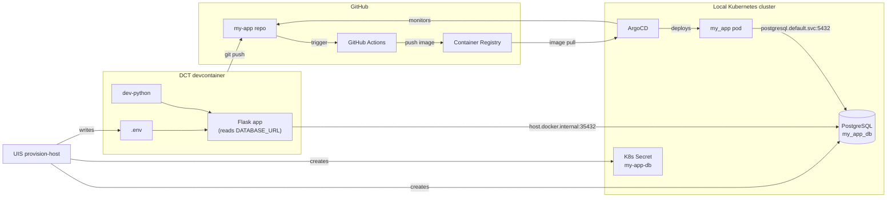
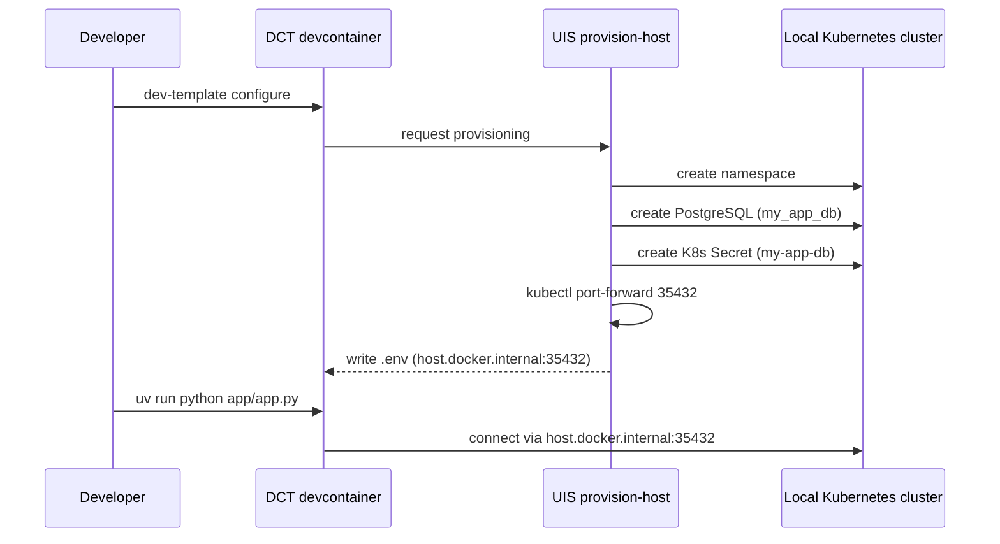
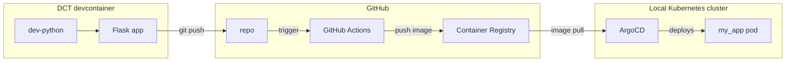
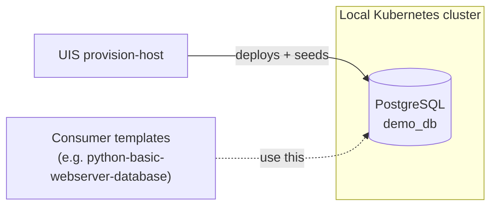
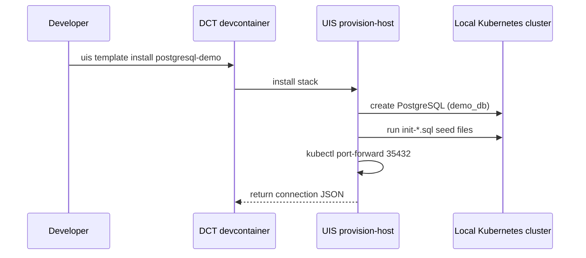

# Investigate: Per-Template Architecture Diagram (Mermaid)

> **IMPLEMENTATION RULES:** Before implementing this plan, read and follow:
> - [WORKFLOW.md](../../WORKFLOW.md) - The implementation process
> - [PLANS.md](../../PLANS.md) - Plan structure and best practices

## Status: Decided — ready for plan (2026-04-11)

**Goal**: Determine the best way to render an auto-generated architecture diagram on each template's documentation page that visualises *what gets set up and the systems involved*, using data the website already has (template-info.yaml, manifests/deployment.yaml, vendored DCT/UIS registries).

**Last Updated**: 2026-04-11

**Downstream plan**: `PLAN-template-architecture-diagram.md` — to be drafted once `PLAN-environment-card.md` Phase 4 completes.

---

## Background

User request, paraphrased: *"Visualise what is being set up and the systems involved. We have a Postgres DB inside a Kubernetes cluster. UIS sets up the Postgres. DCT asks UIS to create a namespace, user/password, initiate a test database. DCT installs Python, creates the config, runs the Python for local dev inside the DCT. GitHub runs CI via GitHub Actions. Later we will add the commands DCT runs to tell UIS to set up ArgoCD and deploy the app built by GitHub Actions."*

In short: a per-template architecture diagram that shows the actors, what they create, and how data flows. The existing text-based [Environment card](../completed/PLAN-environment-card.md) lists *what* gets set up; the diagram answers *where things live* and *how they connect*.

The diagram is content, not interaction. It should:
- Render at build time (no client-side JS dependency for the visual)
- Auto-generate from existing template files (zero contributor work)
- Adapt to template kind (app vs stack vs overlay) and complexity (with/without services)
- Stay consistent with the existing platform-level diagrams in `website/docs/architecture.md`
- Be readable on mobile

---

## Current State

### Existing Mermaid usage in this repo

`website/docs/architecture.md` already uses Mermaid extensively. It has 5+ diagrams covering the platform architecture, three-project layout, metadata flow, execution contexts, and infrastructure setup. Established conventions:

- **Plain text labels**, no emojis
- **`subgraph` blocks** to group components into logical zones (e.g., `"Local Kubernetes Cluster (Test environment)"`, `"GitHub"`, `"DCT"`, `"UIS"`)
- **Both `flowchart LR` and `flowchart TB`** depending on the relationship being shown
- **Standard arrows**: solid `-->` for direct calls / data flow
- **Plain edge labels** like `Push code`, `Trigger`, `Sync`, `Build & Push`
- **Quoted subgraph labels** for human-readable group names
- **No custom CSS classes** — uses default Mermaid theming, which respects Docusaurus dark/light mode automatically via `@docusaurus/theme-mermaid`

Per-template diagrams should be a *zoomed-in instance* of the same vocabulary, not a different style.

### Docusaurus support

- `@docusaurus/theme-mermaid@^3.9.2` is in `website/package.json`
- `docusaurus.config.ts` enables it: `markdown: { mermaid: true }` + theme registration
- Fenced ` ```mermaid ` code blocks render as SVG at build time. No new component, no new prop encoding
- Mermaid 10.x supports flowcharts with subgraphs, sequence diagrams, dashed edges, cylinder shapes, and `<br/>` in labels

### Data already on the registry entry (post Phase 2+3 of PLAN-environment-card.md)

Each template's `template-registry.json` entry currently has the fields below. **No new data fields are needed** — the diagram is a different projection of the same data the Environment card already uses.

| Field | Source | What it tells us about the diagram |
|---|---|---|
| `templateKind: 'app' \| 'stack'` | derived from `install_type` | drives which subgraphs to render |
| `install_type: 'app' \| 'overlay' \| 'stack'` | template-info.yaml | overlay templates need no diagram |
| `resolvedTools: ResolvedTool[]` | DCT tools.json + tools: field | nodes for the DCT subgraph |
| `resolvedServices: ResolvedService[]` | UIS services.json + requires/provides | nodes for the K8s subgraph + edges from UIS |
| `manifest: { envVar, secretName, containerPort }` | manifests/deployment.yaml | tells us if there's a deployable consumer app |
| `resolvedInitFiles` | config/init-*.sql | annotation on the database node |
| `params.app_name`, `params.database_name` | template-info.yaml | concrete names for boxes |

### Size targets

Mermaid diagrams break down visually past ~15 nodes. Target **5–12 nodes** per flowchart depending on template complexity. The maximum interesting case (`python-basic-webserver-database`) is about 12 nodes + 13 edges — tight but readable in `flowchart LR`.

---

## Decisions

User made all 11 calls on 2026-04-11. Summary:

| # | Decision |
|---|---|
| A. Diagram type | **Two diagrams per template**: flowchart (steady-state) + sequence (configure-time flow) |
| B. Placement | **Between Environment card and README**, under a single `## Architecture` heading |
| C. Composition | **New `scripts/lib/build-architecture-mermaid.ts`** imported by `generate-registry.ts` |
| D. Visual style | **Match `architecture.md`** — no emojis, default theming, plain-text labels |
| E. Per-template variation | **State-machine builder**; overlays skip both diagrams |
| F. ArgoCD chain | **Solid edge** `GitHub Actions → ArgoCD → Kubernetes` (not dashed, not deferred) |
| G. Escape hatch | **None** — fully auto-generated |
| H. Mobile | **`flowchart LR`**, accept horizontal scroll on phones |
| I. Testing | **Build-time smoke test + unit test** on the builder |
| J. Click-to-link | **Skip v1**, revisit later |

### Rationale

- **A (two diagrams)** — Flowchart answers *where does it live*; sequence answers *what happens when I run configure*. Complementary, not redundant. Rejected C4 (experimental Mermaid support), rejected sequence-only (loses steady-state view).
- **B (between card and README)** — The Environment card is the primary text view; the diagram is its visual summary, so it sits *after*. README follows because it's template-specific narrative.
- **C (new TS module)** — Mirrors the `dct-doc-paths.ts` pattern from Phase 1 of the Environment card work. Keeps data resolution and string building logically separate, unit-testable in isolation.
- **D (match architecture.md)** — The repo already has 5+ Mermaid diagrams establishing a plain-text, no-emoji vocabulary. Consistency beats novelty for technical docs.
- **E (state machine)** — Four archetypes (app+svc+manifest, app no svc, stack, overlay) need different subgraphs; conditional builder handles all four without special cases.
- **F (solid ArgoCD edge)** — User's call: draw the full chain even though ArgoCD integration isn't end-to-end tested yet. When the real shape differs, update the builder.
- **G (no escape hatch)** — One source of truth. Add a yaml override only if a real template breaks the auto-generator.
- **H (LR, accept scroll)** — Architecture diagrams are desktop-first; the Environment card is the mobile-first primary view.
- **I (smoke + unit)** — Build-time validation is free (Docusaurus parses every mermaid block). Unit tests cover the conditional builder logic.
- **J (no click-through)** — Environment card already provides linked tool/service names. Diagram click targets are low-affordance.

---

## Dependencies

This plan has two hard prerequisites. Neither is blocking the *investigation*, but both must ship before the downstream `PLAN-template-architecture-diagram.md` can start.

### 1. `PLAN-environment-card.md` Phase 4

Phase 4 of the Environment card plan is link verification + cleanup of `<TemplateGetStarted>`. The architecture-diagram plan reuses the same registry-generation pipeline, so it must wait until Phase 4 completes and the plan moves to `completed/` (one active plan at a time per WORKFLOW.md).

### 2. `template-info.yaml` schema refactor (separate future investigation)

**Discovered during diagram-label review on 2026-04-11.** The E1 sequence diagram needs to emit an accurate "developer runs the app" step, but today the run command is conflated with setup commands in `quickstart.commands[]`:

```yaml
# Today (all 10 templates)
quickstart:
  title: "Run the Flask app"
  commands:
    - uv venv
    - uv pip install -r requirements.txt
    - uv run python app/app.py   # ← run command mixed in with setup
```

The sequence builder needs a clean `quickstart.run` field to read verbatim. User has also indicated there are **other `template-info.yaml` fields** that want similar treatment — so rather than a one-off split, this is a schema refactor worth its own investigation.

**Status**: Deferred. User will create a separate `INVESTIGATE-template-info-schema-refactor.md` (or similar) later. This plan does not block on that investigation being written — it blocks on the *shipped outcome* of whatever plan the schema investigation produces.

**What the architecture-diagram plan needs from the refactor**:

- A distinct `quickstart.run: string` field (or equivalent) that the sequence builder can read directly
- A distinct `quickstart.setup: string[]` field (or equivalent) — not strictly required by the diagram, but needed by the refactor to cleanly separate run from setup

**Not in scope for this investigation** — the exact shape of the refactored schema, the migration approach, the other fields the user wants added. All of that lives in the future schema-refactor investigation.

---

## Design details

Four things that weren't part of the original 11 questions but are needed before a PLAN can be drafted.

### D1. Registry entry shape

The builder module exports a single function returning two strings (or nulls):

```ts
interface ArchitectureMermaid {
  architectureFlowchart: string | null;  // null iff overlay
  architectureSequence: string | null;   // null iff overlay OR no services
}
```

Both fields are always present on the registry entry; they are `null` (not empty string, not missing) when absent. This lets `generate-docs-markdown.sh` use a simple `jq` null check to decide whether to emit each block.

- **Overlay templates** → both fields `null`, entire `## Architecture` section suppressed
- **App template with no services** (E2) → flowchart present, sequence `null`, section heading present but `### Configure flow` sub-heading suppressed
- **Everything else** → both fields present

### D2. ArgoCD node placement

- **Where**: ArgoCD renders as a node *inside* the `k8s` subgraph — it runs on the cluster as a controller.
- **Which templates**: Only templates with a `manifest` field (i.e., deployable consumer apps). Stack templates (E3) are deployment *targets*, not sources, so they don't render ArgoCD.
- **Which edges**: `ghcr --> argo --> app_pod` as solid edges. ArgoCD does *not* connect to the database — UIS owns that. The `app_pod` node connects to `pg` via a normal runtime edge, same as the dev-mode Flask app.

### D3. On-page layout

```
<TemplateEnvironment />

## Architecture

### Steady-state


### Configure flow

```mermaid
sequenceDiagram
...
```

[README content follows]
```

- **Single `## Architecture` heading** (one TOC entry, consistent section level with other doc pages)
- **Two `### ` sub-headings** so readers know what each diagram shows at a glance
- **If `architectureSequence` is null** (E2): the `### Configure flow` sub-heading is suppressed and only the flowchart appears under `## Architecture`
- **If both are null** (E4): the entire `## Architecture` section is skipped — no heading, no blocks

### D4. Builder pseudocode

```text
function buildArchitecture(entry):
  if entry.install_type == 'overlay':
    return { flowchart: null, sequence: null }

  flowchart = buildFlowchart(entry)    // always for non-overlay
  sequence = entry.resolvedServices.length > 0
    ? buildSequence(entry)
    : null                              // skip for app-no-services (E2)

  return { flowchart, sequence }

function buildFlowchart(entry):
  lines = ['flowchart LR']
  if entry.resolvedTools.length > 0:
    emit dct subgraph with tool nodes + app node
  if entry.resolvedServices.length > 0:
    emit k8s subgraph with service nodes + (if manifest) argo + app_pod nodes
    emit uis node
    emit edges: uis -> each service, uis -> .env if manifest
  if entry.install_type == 'app':
    emit github subgraph (repo, actions, ghcr)
    emit push/trigger/build edges
    if entry.manifest:
      emit ghcr -> argo -> app_pod edges
      emit app_pod -> service edges
  if entry.install_type == 'stack':
    emit uis -> service edges with "deploys + seeds" labels
    emit dashed "consumers use this" edge from an external node
  return lines.join('\n')
```

---

## Diagram drafts per archetype

### E1. App + services + manifest (e.g., `python-basic-webserver-database`)

**Flowchart:**



**Sequence (configure flow):**



### E2. App, no services (e.g., `python-basic-webserver`)

**Flowchart:**



**Sequence:** **Skipped.** Nothing interesting to show — no UIS, no K8s provisioning, just `dev-template configure` installing tools. The README already documents the configure and run steps in text.

### E3. Stack template (e.g., `postgresql-demo`)

**Flowchart:**



**Sequence:**



### E4. Overlay template (e.g., `plan-based-workflow`)

**Neither diagram rendered.** Overlay templates don't deploy anything; they add files to an existing project. The page already correctly suppresses the Environment card for these (per PLAN-environment-card.md acceptance criterion). Same rule: the entire `## Architecture` section is skipped silently.

---

## Alternatives considered (rejected)

Compressed record of options rejected during the decision process — kept for future "why didn't you…" questions.

- **Diagram tool**: C4 Mermaid (experimental), draw.io (manual XML), PlantUML (not in deps), ASCII art (no visual), hand-coded SVG (no semantic structure) — all rejected in favour of Mermaid.
- **Diagram type**: flowchart-only was the original recommendation; user expanded to flowchart + sequence. Pure sequence rejected — loses the steady-state "where does it live" view.
- **Placement**: B1 (above Env card) and B2 (inside Env card as a sub-block) rejected; B3 (below Env card) chosen because the card is the primary text view and the diagram is its visual summary.
- **Composition**: C1 (all logic in `generate-registry.ts`) and C2 (bash + jq string assembly) rejected in favour of C3 (separate TS module).
- **Visual style**: D2 (emoji icons 💻 ☸️ 🐙) and D3 (`classDef` colors) rejected for consistency with existing `architecture.md`.
- **ArgoCD**: F2 (exclude until tested) and F3 (dashed "planned" edge) rejected in favour of drawing the solid chain now.
- **Escape hatch**: G2 (optional per-template yaml override) rejected to avoid two code paths and style drift.
- **Testing**: I3 (snapshot files) and I4 (pixel-diff visual regression) rejected as overkill for v1.
- **Click-to-link**: deferred to v2 — Environment card already provides linked tool/service names below the diagram.

---

## Risks and Things That Could Go Wrong

- **Mermaid version bump in Docusaurus** — if Docusaurus upgrades to a Mermaid major that drops a feature we use (e.g., subgraph syntax change), every diagram breaks at build time. Mitigation: pin Docusaurus version, watch release notes. Build-time validation catches this immediately.
- **Diagram complexity creep** — once we start adding nodes, every reviewer will want "just one more". Mitigation: cap at 12 nodes per diagram; if a template needs more, either (a) it's actually two diagrams or (b) the architecture is too complex for a single visual and we accept it.
- **Auto-generated diagrams looking generic** — every database template will look the same. This is not actually a problem — the goal is consistency, not novelty.
- **ArgoCD chain shipping in a different shape than we drew** — we're drawing the chain as solid edges before the real integration exists. When the real thing ships, we may need to redraw. Mitigation: keep labels vague (`image pull`, `deploys`) rather than committing to a specific mechanism (`Application CR`, `watch`, etc.).
- **Sequence diagram diverges from flowchart** — two diagrams means two representations of the same reality. They can drift if updated independently. Mitigation: both are generated from the same registry entry in the same builder function, so any data change updates both automatically.
- **Diagrams becoming a thing contributors fight to customise** — we explicitly reject the escape hatch (G1). If pressure mounts for per-template customisation, we revisit; until then, hold the line.

---

## Next Steps

- [ ] Create `PLAN-template-architecture-diagram.md` in `backlog/` based on the locked-in decisions above
  - **Phase 1**: builder module (`scripts/lib/build-architecture-mermaid.ts`) emitting `architectureFlowchart` and `architectureSequence`, with unit tests covering all four archetypes
  - **Phase 2**: integrate into `generate-registry.ts`, write both fields onto each registry entry
  - **Phase 3**: update `generate-docs-markdown.sh` to emit the `## Architecture` section (with conditional `### Configure flow` sub-heading) between `<TemplateEnvironment />` and the README
  - **Phase 4**: visual review across all 10 templates + adjust
  - **Phase 5**: docs (mention in `readme-structure.md`)
- [ ] Plan does NOT start until **both** prerequisites are complete:
  - `PLAN-environment-card.md` Phase 4 finished and plan moved to `completed/`
  - `template-info.yaml` schema refactor shipped (separate future investigation — see § Dependencies). The architecture-diagram plan needs a clean `quickstart.run` field.
