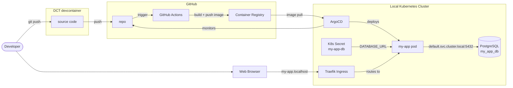
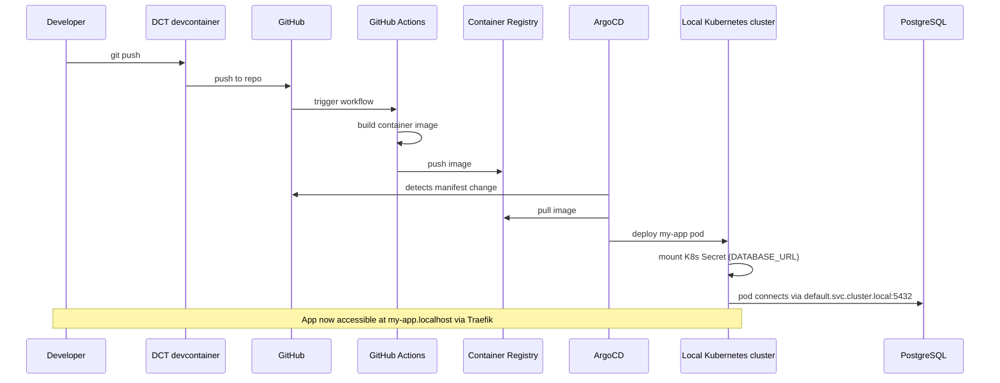

# Deploy flowchart — for manual editing

> Edit this file to get the diagram right, then hand it back so I can
> update the builder to match.

## CI/CD deployment (E1: python-basic-webserver-database)

## Deploy flow (E1: python-basic-webserver-database)

Sequence diagram showing what happens when the developer pushes code
and ArgoCD picks it up.

