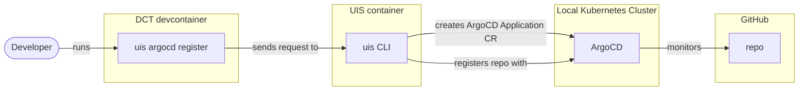
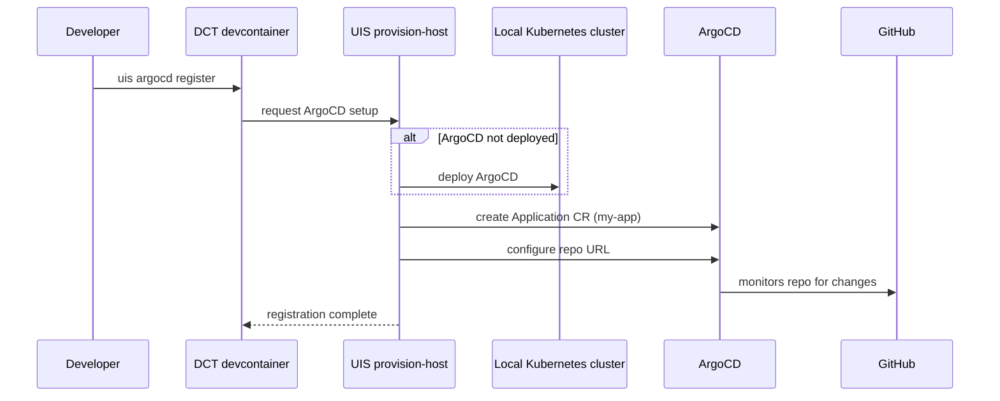

# ArgoCD setup flowchart — for manual editing

> This is the bridge between the local-dev diagram and the deploy diagram.
> Before ArgoCD can monitor the repo and deploy the app, UIS must register
> the repo with ArgoCD. This command is not yet implemented in UIS but the
> diagram documents the planned flow.
>
> Edit this file to get the diagram right, then hand it back so I can
> update the builder to match.

## ArgoCD registration (E1: python-basic-webserver-database)

## ArgoCD setup flow (E1: python-basic-webserver-database)

Sequence diagram for the ArgoCD registration — mirrors the database
configure flow but sets up deployment instead of provisioning.
Command names are placeholders until UIS implements this.

