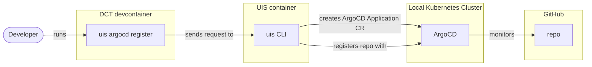
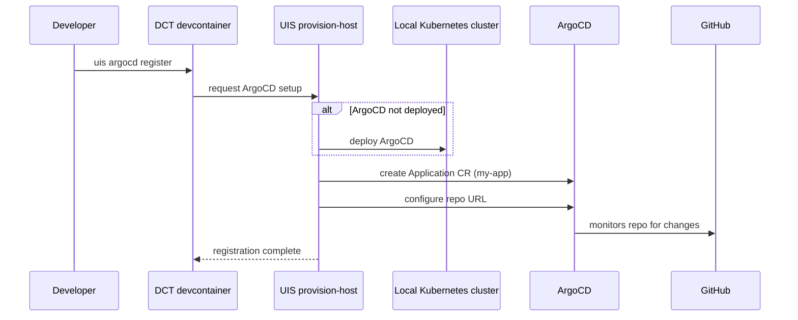

# ArgoCD setup flowchart — design preserved, implementation deferred

> **Status: Design preserved; implementation deferred** — The design is done, but the third `### ArgoCD setup` sub-section is **not** currently rendered on template pages. It's suppressed pending UIS shipping a `uis argocd register` command.
>
> When UIS ships the command, a downstream PR should:
> 1. Add an `ArchitectureDiagram` entry named "ArgoCD setup" (or similar) to the relevant section in `buildArchitectureModel` inside `scripts/lib/build-architecture-mermaid.ts`
> 2. Add a new builder function (e.g. `buildArgoCdSetupFlowchart(entry)`) that returns the mermaid source — use the diagram below as the source of truth
> 3. The emitter + client module handle the rest without changes
>
> See [INVESTIGATE-architecture-diagram-v2.md](INVESTIGATE-architecture-diagram-v2.md) § Q4 for the decision to suppress, and [PLAN-architecture-diagram-v2.md](PLAN-architecture-diagram-v2.md) for the broader arc this diagram was designed against.
>
> Original heading kept: "This is the bridge between the local-dev diagram and the deploy diagram. Before ArgoCD can monitor the repo and deploy the app, UIS must register the repo with ArgoCD. This command is not yet implemented in UIS but the diagram documents the planned flow."

## ArgoCD registration (E1: python-basic-webserver-database)

## ArgoCD setup flow (E1: python-basic-webserver-database)

Sequence diagram for the ArgoCD registration — mirrors the database
configure flow but sets up deployment instead of provisioning.
Command names are placeholders until UIS implements this.

