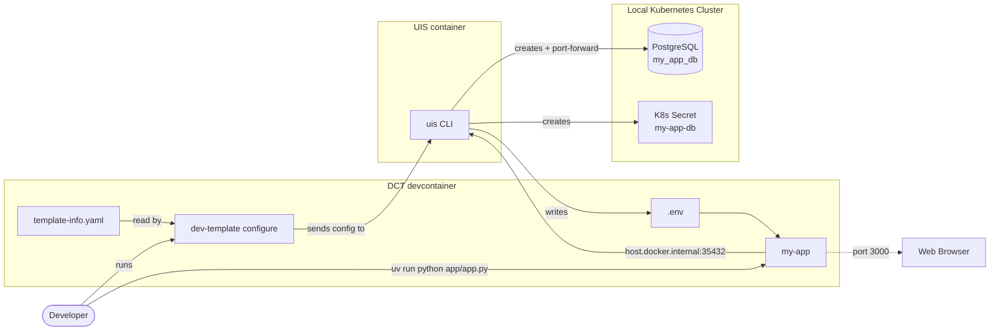
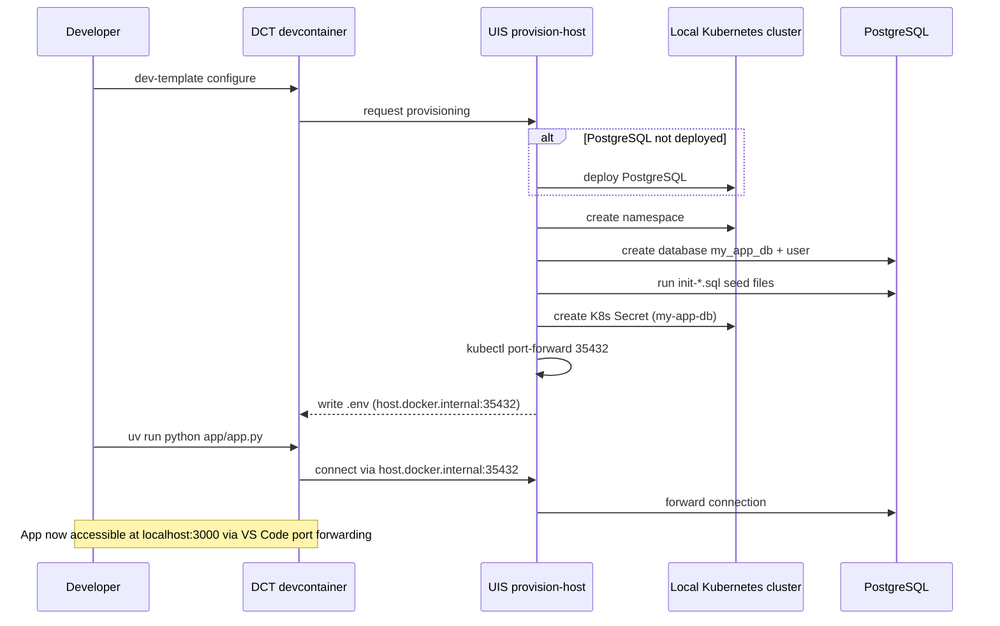

# Steady-state flowchart v2 — Developer outside DCT + browser

> **Status: Shipped (2026-04-12)** — Design for the Local development flowchart. Approved during [INVESTIGATE-architecture-diagram-v2.md](INVESTIGATE-architecture-diagram-v2.md) and implemented in `scripts/lib/build-architecture-mermaid.ts` via `buildLocalDevFlowchart(entry)`. Preserved here as a historical design reference — the code is the source of truth; this file captures the author's original intent.
>
> Builds on v1 from mermaid-steady-state.md. Developer moved outside DCT as an external actor. Browser added to close the feedback loop.

## Local development setup (E1: python-basic-webserver-database)

## Configure flow (E1: python-basic-webserver-database)

Sequence diagram showing the local development setup — what happens
when the developer runs `dev-template configure` and then starts the app.

