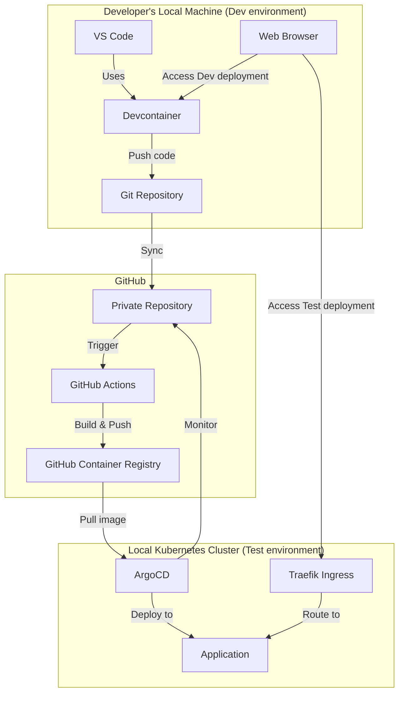
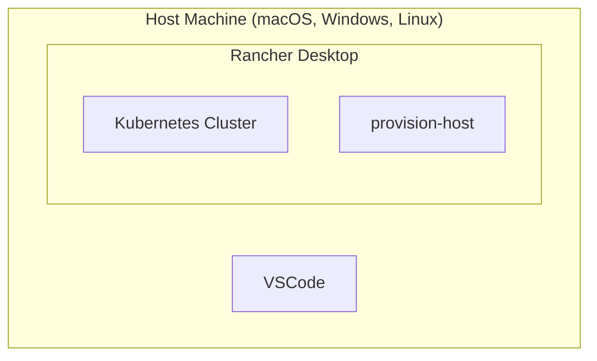

# Architecture Overview

## Developer Platform Architecture



### Key Components

- **VS Code + Devcontainers**: Provides a consistent development environment for application code
- **Rancher Desktop**: Delivers local Kubernetes clusters for developers
- **ArgoCD**: Handles GitOps-based deployment of applications
- **Traefik**: Ingress controller pre-installed in the cluster for routing
- **GitHub Actions**: Automated CI/CD pipelines for building and pushing container images
- **GitHub Container Registry**: Storage for container images
- **provision-host**: Utility container with administrative tools for configuration

## Infrastructure Setup



### Setup Steps

1. **Install Rancher Desktop** — Provides the Kubernetes cluster and container runtime needed for local development
2. **Clone Infrastructure Repository** — One script sets up a kubernetes cluster with tools and services needed to develop and deploy applications. An utilities container `provision-host` for managing the local cluster and providing administrative tools. No code or programs are installed on your local machine, all needed tools are installed in the container. Everyone has the same setup, and the setup is the same on all platforms (macOS, Windows, Linux).

## Kubernetes Manifest Design

The manifests are structured to be automatically parameterized during template setup. The files are in the `manifests/` directory and are used by ArgoCD to deploy the application.

- **deployment.yaml**: Defines the application Deployment and Service
- **kustomization.yaml**: Ties the resources together for ArgoCD

Routing is handled automatically by the platform — when you run `uis argocd register`, it creates a Traefik IngressRoute that routes `<app-name>.localhost` to your application. Repos do not need to include ingress manifests.

## Folder Structure

Each template follows this structure (example: TypeScript web server):

```plaintext
project-repository/
├── app/               # Application code
│   └── index.ts
├── manifests/         # Kubernetes manifests for ArgoCD
│   ├── deployment.yaml
│   └── kustomization.yaml
├── .github/workflows/ # CI/CD pipeline
├── Dockerfile         # Container definition
└── README.md
```
