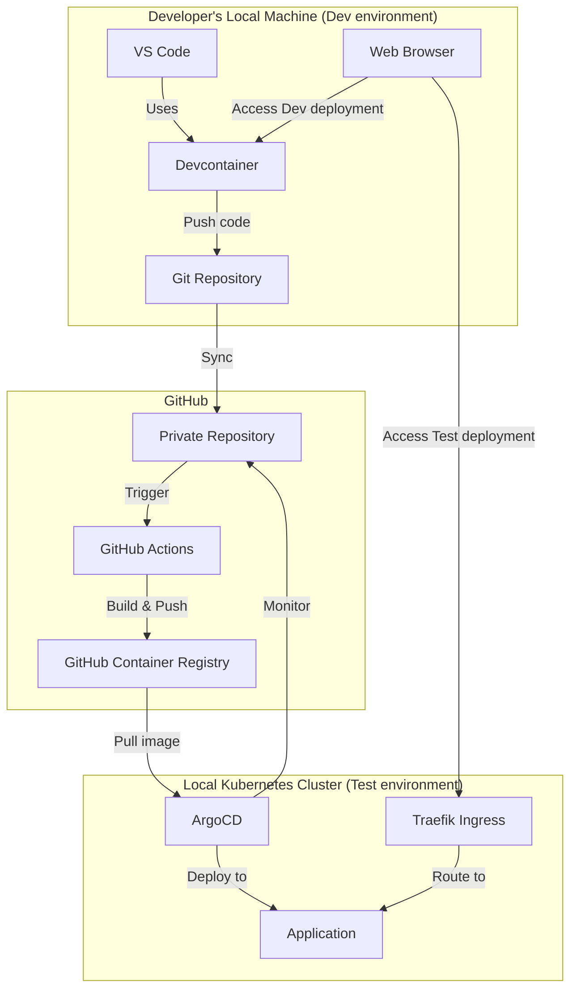
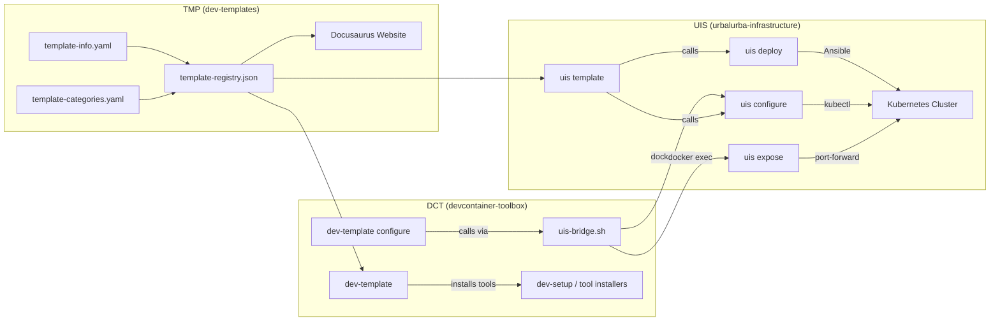
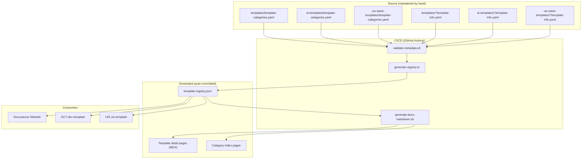
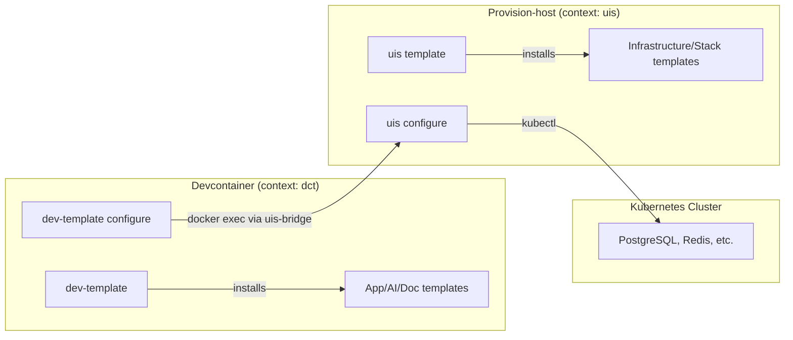
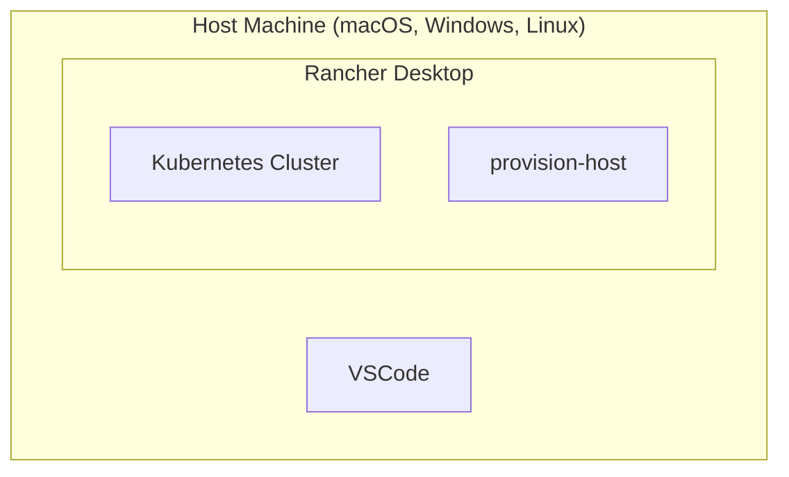

# Architecture Overview

:::caution[Under review — 2026-04-17]

This page is being updated to reflect the current platform architecture. Some diagrams and descriptions may be outdated.

:::

The platform is built from three projects — **DCT** (the developer's devcontainer), **UIS** (the infrastructure provisioner), and **TMP** (the template library and this website). Together they give a developer a two-command path from "I picked a template" to "my app is running with a database in a local Kubernetes cluster."

This page shows how the pieces connect.

## Developer Platform Architecture



### Key Components

- **VS Code + Devcontainers**: Provides a consistent development environment for application code
- **Rancher Desktop**: Delivers local Kubernetes clusters for developers
- **ArgoCD**: Handles GitOps-based deployment of applications
- **Traefik**: Ingress controller pre-installed in the cluster for routing
- **GitHub Actions**: Automated CI/CD pipelines for building and pushing container images
- **GitHub Container Registry**: Storage for container images
- **provision-host**: Utility container with administrative tools for configuration

## Three-Project Architecture

The developer platform is built from three repositories that work together:



| Project | Role | What it does |
|---------|------|-------------|
| **TMP** (dev-templates) | Template library | Stores all templates, generates the registry, hosts the Docusaurus website. The glue between DCT and UIS. |
| **DCT** (devcontainer-toolbox) | Developer environment | Runs `dev-template` (browse/install templates), `dev-template configure` (set up services), and tool installers. Runs inside the devcontainer. |
| **UIS** (urbalurba-infrastructure) | Infrastructure platform | Runs `uis deploy` (deploy services to K8s), `uis configure` (create databases/users), `uis expose` (port-forward services), `uis template` (install stack templates). Runs in the provision-host container. |

## Template System Architecture

### Metadata Flow



### Two Execution Contexts

Templates run in two different containers depending on their `context`:



| | Devcontainer Templates | UIS Templates |
|---|---|---|
| **Context** | `dct` | `uis` |
| **Folders** | `templates/`, `ai-templates/` | `uis-stack-templates/` |
| **Command** | `dev-template` | `uis template` |
| **Runs in** | Devcontainer (DCT) | Provision-host (UIS) |
| **Has access to** | Project workspace, npm, pip | kubectl, helm, Ansible |
| **Installs** | Files into user's project | Services into K8s cluster |

### Connection Pattern

When an app template needs a database, the connection flows through UIS:

```
DCT devcontainer → uis-bridge.sh → docker exec → UIS provision-host → kubectl → K8s service
```

The developer's app connects to services via `host.docker.internal:<port>`. UIS handles port exposure (kubectl port-forward or NodePort). This works the same whether K8s is local or remote — DCT never connects to K8s directly.

## Infrastructure Setup



### Setup Steps

1. **Install Rancher Desktop** — Provides the Kubernetes cluster and container runtime needed for local development
2. **Clone Infrastructure Repository** — One script sets up a kubernetes cluster with tools and services needed to develop and deploy applications. An utilities container `provision-host` for managing the local cluster and providing administrative tools. No code or programs are installed on your local machine, all needed tools are installed in the container. Everyone has the same setup, and the setup is the same on all platforms (macOS, Windows, Linux).

## Kubernetes Manifest Design

The manifests are structured to be automatically parameterized during template setup. The files are in the `manifests/` directory and are used by ArgoCD to deploy the application.

- **deployment.yaml**: Defines the application Deployment and Service
- **kustomization.yaml**: Ties the resources together for ArgoCD

Routing is handled automatically by the platform — when you run `uis argocd register`, it creates a Traefik IngressRoute that routes `<app-name>.localhost` to your application. Repos do not need to include ingress manifests.

## Folder Structure

Each app template follows this structure:

```plaintext
project-repository/
├── app/               # Application code
│   └── main.ext
├── config/            # Init files for service setup (if template has requires)
│   └── init-database.sql
├── manifests/         # Kubernetes manifests for ArgoCD
│   ├── deployment.yaml
│   └── kustomization.yaml
├── .github/workflows/ # CI/CD pipeline
├── Dockerfile         # Container definition
├── template-info.yaml # Template metadata (used by dev-template configure)
└── README.md
```
