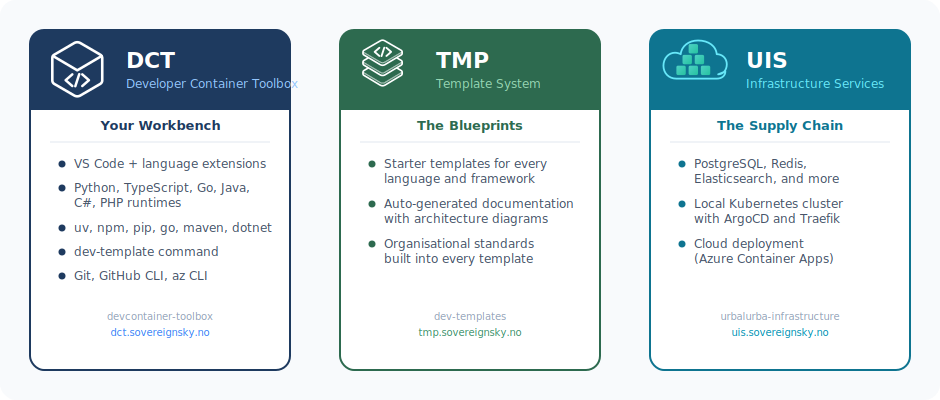
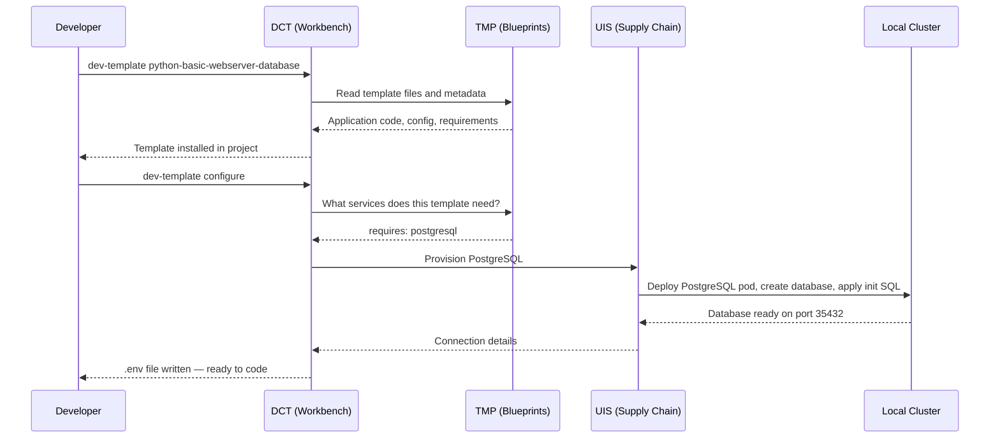

import DeploymentTargets, { DeploymentTargetCards } from '@site/src/components/DeploymentTargets';

# The Platform — DCT, TMP, and UIS

The developer platform is built from three projects that work together. Each has a clear job.

## DCT — Your Workbench

**Full name:** Developer Container Toolbox

DCT is the developer's desk with every tool already in place. It provides a devcontainer — a pre-configured development environment that runs inside VS Code. No matter what operating system you use (macOS, Windows, Linux), every developer gets the same setup: same language runtimes, same package managers, same editor extensions.

**What it provides:**

- A devcontainer with all languages pre-installed (Python, TypeScript, Go, Java, C#, PHP)
- The `dev-template` command for installing and configuring templates
- VS Code extensions for each language
- Git, GitHub CLI, and other development tools

**Website:** [dct.sovereignsky.no](https://dct.sovereignsky.no) — **Repository:** [github.com/helpers-no/devcontainer-toolbox](https://github.com/helpers-no/devcontainer-toolbox)

## TMP — The Blueprints

**Full name:** Template System

TMP is the recipe book. It contains all the starter templates and their documentation. When a developer wants to build an app, they start here — browsing templates, reading what each one provides, and picking the one that fits.

**What it provides:**

- Starter templates for different languages and frameworks
- Auto-generated documentation for every template
- Best practices baked into every template — code structure, security, CI/CD, documentation

**Website:** [tmp.sovereignsky.no](https://tmp.sovereignsky.no) — **Repository:** [github.com/helpers-no/dev-templates](https://github.com/helpers-no/dev-templates)

## UIS — The Supply Chain

**Full name:** Urbalurba Infrastructure Services

UIS is the supply chain. When a template needs a database, a cache, or any other infrastructure service, UIS knows how to set it up. It provisions services in the local Kubernetes cluster during development, and can do the same in cloud environments (like Azure) for production.

**What it provides:**

- A catalogue of infrastructure services (PostgreSQL, Redis, Elasticsearch, and more)
- Scripts to provision those services locally or in the cloud
- Port forwarding so the developer's app can reach services running in the cluster
- The local Kubernetes cluster setup (ArgoCD, Traefik ingress, namespaces)
- Deployment target provisioning for Azure Container Apps, AKS, Ubuntu K8s, and Raspberry Pi

**Website:** [uis.sovereignsky.no](https://uis.sovereignsky.no) — **Repository:** [github.com/helpers-no/urbalurba-infrastructure](https://github.com/helpers-no/urbalurba-infrastructure)

**Available services:** [uis.sovereignsky.no/services](https://uis.sovereignsky.no/services)

## How they work together

The three projects form a chain. The developer interacts with **DCT** (through VS Code and the terminal). DCT reads from **TMP** (which template to install, what services it needs). DCT then calls **UIS** (to actually provision those services).

The developer never talks to UIS or TMP directly. Everything goes through DCT — two commands and the environment is ready.

## Deployment targets

UIS can provision services and deploy applications into multiple environments. The developer selects a target, and UIS handles the rest.

:::caution[TODO — 2026-04-17]

The website/src/deployment-targets.json is not finished yet

:::

<DeploymentTargetCards />

<DeploymentTargets />

The same template works on any target. The developer writes code once; `dev-template configure --target <name>` provisions the right services in the right environment.

## Why three projects instead of one?

Each project is maintained by the people closest to its concerns:

| Project | Maintained by | Concern |
|---------|--------------|---------|
| **DCT** | Developer experience team | "What tools does a developer need on their laptop?" |
| **TMP** | Template authors | "What starter code should we offer?" |
| **UIS** | Infrastructure team | "How do we provision and manage services?" |

A template author can add a new template without knowing how Kubernetes works. An infrastructure engineer can add a new service to UIS without knowing Python or React. A developer experience engineer can improve the devcontainer without touching templates or infrastructure. The boundaries keep things maintainable as the platform grows.
