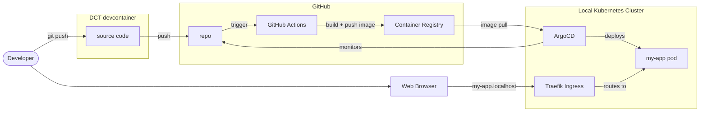
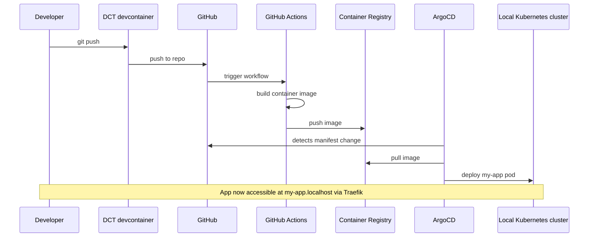

import TemplateHeader from '@site/src/components/TemplateHeader';

<TemplateHeader
  logo="/img/templates/csharp-basic-webserver-logo.svg"
  name="C# Basic Webserver"
  version="1.0.0"
  description="ASP.NET Core server with health endpoint and Docker support"
  abstract={"A minimal ASP.NET Core web server with hot reload via dotnet watch. Includes Docker multi-stage build, Kubernetes deployment manifests, and GitHub Actions CI/CD workflow."}
  install="dev-template csharp-basic-webserver"
  links={[{"url":"https://github.com/helpers-no/dev-templates/tree/main/templates/csharp-basic-webserver","title":"Source code","icon":"github"}]}
  maintainers={["terchris"]}
  tags={["csharp","dotnet","aspnet","webserver","api","rest"]}
  tools="dev-csharp"
/>


<div className="templateCard">
<div className="templateCardEyebrow">GETTING STARTED</div>

### Prerequisites

- [ ] [DCT devcontainer running](https://dct.sovereignsky.no)

### Related templates

- [Java Basic Webserver](../basic-web-server/java-basic-webserver)
- [Go Basic Webserver](../basic-web-server/golang-basic-webserver)

</div>

import TemplateEnvironment from '@site/src/components/TemplateEnvironment';

<TemplateEnvironment
  requires={null}
  params={{"app_name":"my-app"}}
  quickstart={{"title":"Run the ASP.NET Core app","setup":[],"run":"dotnet watch run","note":"ASP.NET Core runs on port 3000 with hot reload via dotnet watch. VS Code auto-forwards the port.\n"}}
  tools={[{"id":"dev-csharp","name":"C# Development Tools","description":"Installs .NET SDK, ASP.NET Core Runtime, and VS Code extensions for C# development","website":"https://dotnet.microsoft.com","docsUrl":"https://dct.sovereignsky.no/docs/tools/development-tools/csharp"}]}
  services={[]}
  templateKind={"app"}
  initFiles={{}}
  configureCommand={null}
  templateInfoYaml={null}
  expectedOutputBlock={null}
/>


<div className="templateCard">
<div className="templateCardEyebrow">ARCHITECTURE</div>

## Architecture

These diagrams are auto-generated from the template's metadata. Click any diagram to enlarge.

### Deployment

<details className="dropdownBlock">
<summary>Components</summary>



<a href="https://mermaid.live/edit#base64:eyJjb2RlIjoiZmxvd2NoYXJ0IExSXG4gICAgZGV2KFtcIkRldmVsb3BlclwiXSlcbiAgICBicm93c2VyW1wiV2ViIEJyb3dzZXJcIl1cblxuICAgIHN1YmdyYXBoIGRjdFtcIkRDVCBkZXZjb250YWluZXJcIl1cbiAgICAgICAgc3JjW1wic291cmNlIGNvZGVcIl1cbiAgICBlbmRcblxuICAgIHN1YmdyYXBoIGdoW1wiR2l0SHViXCJdXG4gICAgICAgIHJlcG9bXCJyZXBvXCJdXG4gICAgICAgIGFjdGlvbnNbXCJHaXRIdWIgQWN0aW9uc1wiXVxuICAgICAgICBnaGNyW1wiQ29udGFpbmVyIFJlZ2lzdHJ5XCJdXG4gICAgZW5kXG5cbiAgICBzdWJncmFwaCBrOHNbXCJMb2NhbCBLdWJlcm5ldGVzIENsdXN0ZXJcIl1cbiAgICAgICAgdHJhZWZpa1tcIlRyYWVmaWsgSW5ncmVzc1wiXVxuICAgICAgICBhcmdvW1wiQXJnb0NEXCJdXG4gICAgICAgIHBvZFtcIm15LWFwcCBwb2RcIl1cbiAgICBlbmRcblxuICAgIGRldiAtLT58Z2l0IHB1c2h8IHNyY1xuICAgIHNyYyAtLT58cHVzaHwgcmVwb1xuICAgIHJlcG8gLS0+fHRyaWdnZXJ8IGFjdGlvbnNcbiAgICBhY3Rpb25zIC0tPnxidWlsZCArIHB1c2ggaW1hZ2V8IGdoY3JcbiAgICBhcmdvIC0tPnxtb25pdG9yc3wgcmVwb1xuICAgIGdoY3IgLS0+fGltYWdlIHB1bGx8IGFyZ29cbiAgICBhcmdvIC0tPnxkZXBsb3lzfCBwb2RcbiAgICB0cmFlZmlrIC0tPnxyb3V0ZXMgdG98IHBvZFxuICAgIGJyb3dzZXIgLS0+fG15LWFwcC5sb2NhbGhvc3R8IHRyYWVmaWtcbiAgICBkZXYgLS0+IGJyb3dzZXIiLCJtZXJtYWlkIjoie1widGhlbWVcIjpcImRlZmF1bHRcIn0ifQ==" target="_blank" rel="noopener noreferrer" className="mermaidLiveLink">↗ Open in mermaid.live</a>

</details>

<details className="dropdownBlock">
<summary>Flow</summary>



<a href="https://mermaid.live/edit#base64:eyJjb2RlIjoic2VxdWVuY2VEaWFncmFtXG4gICAgcGFydGljaXBhbnQgRGV2IGFzIERldmVsb3BlclxuICAgIHBhcnRpY2lwYW50IERDVCBhcyBEQ1QgZGV2Y29udGFpbmVyXG4gICAgcGFydGljaXBhbnQgR0ggYXMgR2l0SHViXG4gICAgcGFydGljaXBhbnQgQWN0aW9ucyBhcyBHaXRIdWIgQWN0aW9uc1xuICAgIHBhcnRpY2lwYW50IEdIQ1IgYXMgQ29udGFpbmVyIFJlZ2lzdHJ5XG4gICAgcGFydGljaXBhbnQgQXJnbyBhcyBBcmdvQ0RcbiAgICBwYXJ0aWNpcGFudCBLOHMgYXMgTG9jYWwgS3ViZXJuZXRlcyBjbHVzdGVyXG4gICAgRGV2LT4+RENUOiBnaXQgcHVzaFxuICAgIERDVC0+PkdIOiBwdXNoIHRvIHJlcG9cbiAgICBHSC0+PkFjdGlvbnM6IHRyaWdnZXIgd29ya2Zsb3dcbiAgICBBY3Rpb25zLT4+QWN0aW9uczogYnVpbGQgY29udGFpbmVyIGltYWdlXG4gICAgQWN0aW9ucy0+PkdIQ1I6IHB1c2ggaW1hZ2VcbiAgICBBcmdvLT4+R0g6IGRldGVjdHMgbWFuaWZlc3QgY2hhbmdlXG4gICAgQXJnby0+PkdIQ1I6IHB1bGwgaW1hZ2VcbiAgICBBcmdvLT4+SzhzOiBkZXBsb3kgbXktYXBwIHBvZFxuICAgIE5vdGUgb3ZlciBEZXYsSzhzOiBBcHAgbm93IGFjY2Vzc2libGUgYXQgbXktYXBwLmxvY2FsaG9zdCB2aWEgVHJhZWZpayIsIm1lcm1haWQiOiJ7XCJ0aGVtZVwiOlwiZGVmYXVsdFwifSJ9" target="_blank" rel="noopener noreferrer" className="mermaidLiveLink">↗ Open in mermaid.live</a>

</details>

</div>

A minimal ASP.NET Core web server. Displays "Hello World" with current time and date, with hot reload support via `dotnet watch`.

## Quick Start

1. Update your terminal (tools were installed):
   ```bash
   source ~/.bashrc
   ```

2. Run the app:
   ```bash
   dotnet watch run --project src/WebApplication
   ```

3. Open in browser: http://localhost:3000

The server auto-reloads on file changes via `dotnet watch`.

## Prerequisites

Development tools are installed automatically by the devcontainer.
If you need to reinstall, run: `dev-setup`

## Project Structure

After installation, your project contains:

```plaintext
├── src/
│   └── WebApplication/
│       ├── Program.cs                     # ASP.NET Core entry point
│       └── WebApplication.csproj          # Project dependencies
├── manifests/
│   ├── deployment.yaml                    # K8s Deployment + Service
│   └── kustomization.yaml                 # ArgoCD configuration
├── .github/
│   └── workflows/
│       └── build-and-push.yaml            # CI/CD pipeline
├── Dockerfile                             # .NET multi-stage build
├── TEMPLATE_INFO                          # Template metadata
└── README-csharp-basic-webserver.md       # This file
```

## Development

- Edit `src/WebApplication/Program.cs` — the main application file
- Changes auto-reload via `dotnet watch`
- The `/` endpoint returns "Hello World" with the template name and current time/date

## Docker Build

```bash
docker build -t csharp-basic-webserver .
docker run -p 3000:3000 csharp-basic-webserver
```

## Kubernetes Deployment

```bash
kubectl apply -k manifests/
```

The app will be accessible at `http://<app-name>.localhost` after ArgoCD registration.

## CI/CD

The GitHub Actions workflow automatically builds and pushes the Docker image to GitHub Container Registry when changes are pushed to the main branch.

