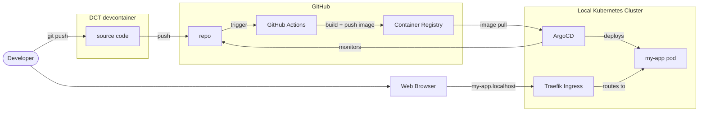
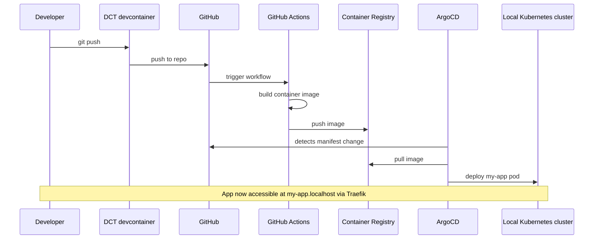

import TemplateHeader from '@site/src/components/TemplateHeader';

<TemplateHeader
  logo="/img/templates/golang-basic-webserver-logo.svg"
  name="Go Basic Webserver"
  version="1.0.0"
  description="Go web server using net/http with health endpoint and Docker support"
  abstract={"A minimal web server using Go's standard net/http package with a health check endpoint. Includes Docker multi-stage build, Kubernetes deployment manifests, and GitHub Actions CI/CD workflow."}
  install="dev-template golang-basic-webserver"
  links={[{"url":"https://github.com/helpers-no/dev-templates/tree/main/templates/golang-basic-webserver","title":"Source code","icon":"github"}]}
  maintainers={["terchris"]}
  tags={["golang","webserver","api","rest"]}
  tools="dev-golang"
/>


<div className="templateCard">
<div className="templateCardEyebrow">GETTING STARTED</div>

### Prerequisites

- [ ] [DCT devcontainer running](https://dct.sovereignsky.no)

### Files

<details className="dropdownBlock">
<summary>Files (9)</summary>

<pre className="filesTree">
├── <a href="https://github.com/helpers-no/dev-templates/blob/main/templates/golang-basic-webserver/.dockerignore" target="_blank" rel="noopener noreferrer">.dockerignore</a>
├── <a href="https://github.com/helpers-no/dev-templates/blob/main/templates/golang-basic-webserver/.gitignore" target="_blank" rel="noopener noreferrer">.gitignore</a>
├── <a href="https://github.com/helpers-no/dev-templates/blob/main/templates/golang-basic-webserver/Dockerfile" target="_blank" rel="noopener noreferrer">Dockerfile</a>
├── <a href="https://github.com/helpers-no/dev-templates/blob/main/templates/golang-basic-webserver/README-golang-basic-webserver.md" target="_blank" rel="noopener noreferrer">README-golang-basic-webserver.md</a>
├── <a href="https://github.com/helpers-no/dev-templates/blob/main/templates/golang-basic-webserver/template-info.yaml" target="_blank" rel="noopener noreferrer">template-info.yaml</a>
├── .github/
│   └── workflows/
│       └── <a href="https://github.com/helpers-no/dev-templates/blob/main/templates/golang-basic-webserver/.github/workflows/urbalurba-build-and-push.yaml" target="_blank" rel="noopener noreferrer">urbalurba-build-and-push.yaml</a>
├── app/
│   └── <a href="https://github.com/helpers-no/dev-templates/blob/main/templates/golang-basic-webserver/app/main.go" target="_blank" rel="noopener noreferrer">main.go</a>
└── manifests/
    ├── <a href="https://github.com/helpers-no/dev-templates/blob/main/templates/golang-basic-webserver/manifests/deployment.yaml" target="_blank" rel="noopener noreferrer">deployment.yaml</a>
    └── <a href="https://github.com/helpers-no/dev-templates/blob/main/templates/golang-basic-webserver/manifests/kustomization.yaml" target="_blank" rel="noopener noreferrer">kustomization.yaml</a>
</pre>

</details>
### Related templates

- [TypeScript Basic Webserver](../basic-web-server/typescript-basic-webserver)
- [Java Basic Webserver](../basic-web-server/java-basic-webserver)

</div>

import TemplateEnvironment from '@site/src/components/TemplateEnvironment';

<TemplateEnvironment
  requires={null}
  params={{"app_name":"my-app"}}
  quickstart={{"title":"Run the Go server","setup":[],"run":"go run main.go","note":"Server runs on port 3000. VS Code auto-forwards the port.\n"}}
  tools={[{"id":"dev-golang","name":"Go Runtime & Development Tools","description":"Installs Go runtime, common tools, and VS Code extensions for Go development.","website":"https://go.dev","docsUrl":"https://dct.sovereignsky.no/docs/tools/development-tools/golang"}]}
  services={[]}
  templateKind={"app"}
  initFiles={{}}
  configureCommand={null}
  templateInfoYaml={null}
  expectedOutputBlock={null}
/>


<div className="templateCard">
<div className="templateCardEyebrow">ARCHITECTURE</div>

## Architecture

These diagrams are auto-generated from the template's metadata. Click any diagram to enlarge.

### Deployment

<details className="dropdownBlock">
<summary>Components</summary>



<a href="https://mermaid.live/edit#base64:eyJjb2RlIjoiZmxvd2NoYXJ0IExSXG4gICAgZGV2KFtcIkRldmVsb3BlclwiXSlcbiAgICBicm93c2VyW1wiV2ViIEJyb3dzZXJcIl1cblxuICAgIHN1YmdyYXBoIGRjdFtcIkRDVCBkZXZjb250YWluZXJcIl1cbiAgICAgICAgc3JjW1wic291cmNlIGNvZGVcIl1cbiAgICBlbmRcblxuICAgIHN1YmdyYXBoIGdoW1wiR2l0SHViXCJdXG4gICAgICAgIHJlcG9bXCJyZXBvXCJdXG4gICAgICAgIGFjdGlvbnNbXCJHaXRIdWIgQWN0aW9uc1wiXVxuICAgICAgICBnaGNyW1wiQ29udGFpbmVyIFJlZ2lzdHJ5XCJdXG4gICAgZW5kXG5cbiAgICBzdWJncmFwaCBrOHNbXCJMb2NhbCBLdWJlcm5ldGVzIENsdXN0ZXJcIl1cbiAgICAgICAgdHJhZWZpa1tcIlRyYWVmaWsgSW5ncmVzc1wiXVxuICAgICAgICBhcmdvW1wiQXJnb0NEXCJdXG4gICAgICAgIHBvZFtcIm15LWFwcCBwb2RcIl1cbiAgICBlbmRcblxuICAgIGRldiAtLT58Z2l0IHB1c2h8IHNyY1xuICAgIHNyYyAtLT58cHVzaHwgcmVwb1xuICAgIHJlcG8gLS0+fHRyaWdnZXJ8IGFjdGlvbnNcbiAgICBhY3Rpb25zIC0tPnxidWlsZCArIHB1c2ggaW1hZ2V8IGdoY3JcbiAgICBhcmdvIC0tPnxtb25pdG9yc3wgcmVwb1xuICAgIGdoY3IgLS0+fGltYWdlIHB1bGx8IGFyZ29cbiAgICBhcmdvIC0tPnxkZXBsb3lzfCBwb2RcbiAgICB0cmFlZmlrIC0tPnxyb3V0ZXMgdG98IHBvZFxuICAgIGJyb3dzZXIgLS0+fG15LWFwcC5sb2NhbGhvc3R8IHRyYWVmaWtcbiAgICBkZXYgLS0+IGJyb3dzZXIiLCJtZXJtYWlkIjoie1widGhlbWVcIjpcImRlZmF1bHRcIn0ifQ==" target="_blank" rel="noopener noreferrer" className="mermaidLiveLink">↗ Open in mermaid.live</a>

</details>

<details className="dropdownBlock">
<summary>Flow</summary>



<a href="https://mermaid.live/edit#base64:eyJjb2RlIjoic2VxdWVuY2VEaWFncmFtXG4gICAgcGFydGljaXBhbnQgRGV2IGFzIERldmVsb3BlclxuICAgIHBhcnRpY2lwYW50IERDVCBhcyBEQ1QgZGV2Y29udGFpbmVyXG4gICAgcGFydGljaXBhbnQgR0ggYXMgR2l0SHViXG4gICAgcGFydGljaXBhbnQgQWN0aW9ucyBhcyBHaXRIdWIgQWN0aW9uc1xuICAgIHBhcnRpY2lwYW50IEdIQ1IgYXMgQ29udGFpbmVyIFJlZ2lzdHJ5XG4gICAgcGFydGljaXBhbnQgQXJnbyBhcyBBcmdvQ0RcbiAgICBwYXJ0aWNpcGFudCBLOHMgYXMgTG9jYWwgS3ViZXJuZXRlcyBjbHVzdGVyXG4gICAgRGV2LT4+RENUOiBnaXQgcHVzaFxuICAgIERDVC0+PkdIOiBwdXNoIHRvIHJlcG9cbiAgICBHSC0+PkFjdGlvbnM6IHRyaWdnZXIgd29ya2Zsb3dcbiAgICBBY3Rpb25zLT4+QWN0aW9uczogYnVpbGQgY29udGFpbmVyIGltYWdlXG4gICAgQWN0aW9ucy0+PkdIQ1I6IHB1c2ggaW1hZ2VcbiAgICBBcmdvLT4+R0g6IGRldGVjdHMgbWFuaWZlc3QgY2hhbmdlXG4gICAgQXJnby0+PkdIQ1I6IHB1bGwgaW1hZ2VcbiAgICBBcmdvLT4+SzhzOiBkZXBsb3kgbXktYXBwIHBvZFxuICAgIE5vdGUgb3ZlciBEZXYsSzhzOiBBcHAgbm93IGFjY2Vzc2libGUgYXQgbXktYXBwLmxvY2FsaG9zdCB2aWEgVHJhZWZpayIsIm1lcm1haWQiOiJ7XCJ0aGVtZVwiOlwiZGVmYXVsdFwifSJ9" target="_blank" rel="noopener noreferrer" className="mermaidLiveLink">↗ Open in mermaid.live</a>

</details>

</div>

A minimal web server using Go's standard `net/http` package. Displays "Hello World" with current time and date, and provides health check endpoints.

## Quick Start

1. Update your terminal (tools were installed):
   ```bash
   source ~/.bashrc
   ```

2. Run the app:
   ```bash
   go run app/main.go
   ```

3. Open in browser: http://localhost:3000

## Prerequisites

Development tools are installed automatically by the devcontainer.
If you need to reinstall, run: `dev-setup`

## Project Structure

After installation, your project contains:

```plaintext
├── app/
│   └── main.go                            # Web server using net/http
├── manifests/
│   ├── deployment.yaml                    # K8s Deployment + Service
│   └── kustomization.yaml                 # ArgoCD configuration
├── .github/
│   └── workflows/
│       └── urbalurba-build-and-push.yaml  # CI/CD pipeline
├── Dockerfile                             # Container build (multi-stage)
├── go.mod                                 # Go module definition
├── TEMPLATE_INFO                          # Template metadata
└── README-golang-basic-webserver.md       # This file
```

## Development

- Edit `app/main.go` — the main application file
- The `/` endpoint returns "Hello World" with the template name and current time/date
- Restart the server after changes (`go run app/main.go` again)

## Docker Build

```bash
docker build -t golang-basic-webserver .
docker run -p 3000:3000 golang-basic-webserver
```

## Kubernetes Deployment

```bash
kubectl apply -k manifests/
```

The app will be accessible at `http://<app-name>.localhost` after ArgoCD registration.

## CI/CD

The GitHub Actions workflow automatically builds and pushes the Docker image to GitHub Container Registry when changes are pushed to the main branch.

