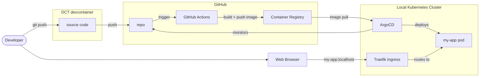
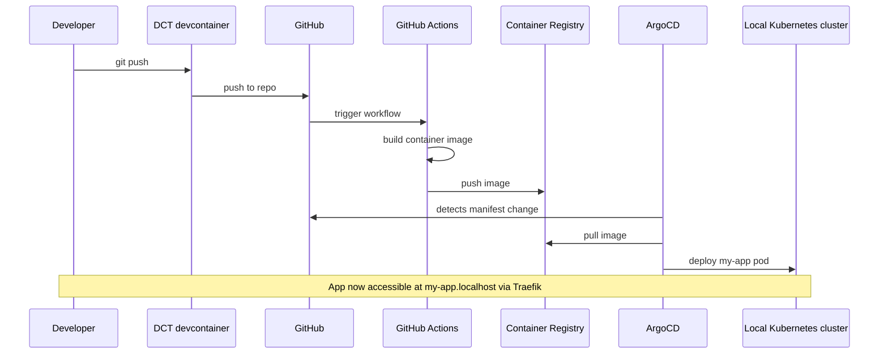

import TemplateHeader from '@site/src/components/TemplateHeader';

<TemplateHeader
  logo="/img/templates/java-basic-webserver-logo.svg"
  name="Java Basic Webserver"
  version="1.0.0"
  description="Spring Boot server with health endpoint and Docker support"
  abstract={"A minimal Spring Boot web server with health check endpoints via Actuator. Includes Docker multi-stage build, Kubernetes deployment manifests, and GitHub Actions CI/CD workflow."}
  install="dev-template java-basic-webserver"
  links={[{"url":"https://github.com/helpers-no/dev-templates/tree/main/templates/java-basic-webserver","title":"Source code","icon":"github"}]}
  maintainers={["terchris"]}
  tags={["java","spring-boot","webserver","api","rest"]}
  tools="dev-java"
/>


<div className="templateCard">
<div className="templateCardEyebrow">GETTING STARTED</div>

### Prerequisites

- [ ] [DCT devcontainer running](https://dct.sovereignsky.no)

### Related templates

- [Go Basic Webserver](../basic-web-server/golang-basic-webserver)
- [C# Basic Webserver](../basic-web-server/csharp-basic-webserver)

</div>

import TemplateEnvironment from '@site/src/components/TemplateEnvironment';

<TemplateEnvironment
  requires={null}
  params={{"app_name":"my-app"}}
  quickstart={{"title":"Run the Spring Boot app","setup":[],"run":"mvn spring-boot:run","note":"Spring Boot runs on port 3000. VS Code auto-forwards the port.\n"}}
  tools={[{"id":"dev-java","name":"Java Runtime & Development Tools","description":"Installs Java JDK, Maven, Gradle, and VS Code extensions for Java development.","website":"https://dev.java","docsUrl":"https://dct.sovereignsky.no/docs/tools/development-tools/java"}]}
  services={[]}
  templateKind={"app"}
  initFiles={{}}
  configureCommand={null}
  templateInfoYaml={null}
  expectedOutputBlock={null}
/>


<div className="templateCard">
<div className="templateCardEyebrow">ARCHITECTURE</div>

## Architecture

These diagrams are auto-generated from the template's metadata. Click any diagram to enlarge.

### Deployment

<details className="dropdownBlock">
<summary>Components</summary>



</details>

<details className="dropdownBlock">
<summary>Flow</summary>



</details>

</div>

A minimal Spring Boot web server. Displays "Hello World" with current time and date, and provides health check endpoints via Spring Boot Actuator.

## Quick Start

1. Update your terminal (tools were installed):
   ```bash
   source ~/.bashrc
   ```

2. Build and run:
   ```bash
   mvn clean package
   java -jar target/*.jar
   ```

3. Open in browser: http://localhost:3000

## Prerequisites

Development tools are installed automatically by the devcontainer.
If you need to reinstall, run: `dev-setup`

## Project Structure

After installation, your project contains:

```plaintext
├── app/
│   └── src/main/java/com/example/
│       └── App.java                       # Spring Boot application
├── manifests/
│   ├── deployment.yaml                    # K8s Deployment + Service
│   └── kustomization.yaml                 # ArgoCD configuration
├── .github/
│   └── workflows/
│       └── urbalurba-build-and-push.yaml  # CI/CD pipeline
├── Dockerfile                             # Container build (multi-stage)
├── pom.xml                                # Maven dependencies
├── TEMPLATE_INFO                          # Template metadata
└── README-java-basic-webserver.md         # This file
```

## Development

- Edit `app/src/main/java/com/example/App.java` — the main Spring Boot application
- The `/` endpoint returns "Hello World" with the template name and current time/date
- Health check endpoints are provided by Spring Boot Actuator
- Rebuild with `mvn clean package` after changes

## Docker Build

```bash
docker build -t java-basic-webserver .
docker run -p 3000:3000 java-basic-webserver
```

## Kubernetes Deployment

```bash
kubectl apply -k manifests/
```

The app will be accessible at `http://<app-name>.localhost` after ArgoCD registration.

## CI/CD

The GitHub Actions workflow automatically builds and pushes the Docker image to GitHub Container Registry when changes are pushed to the main branch.

