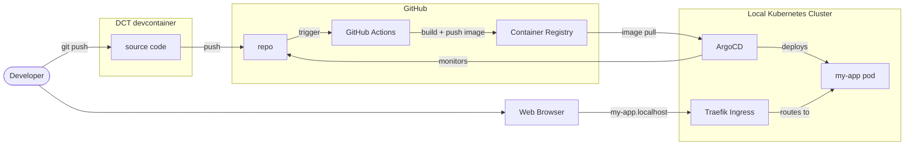
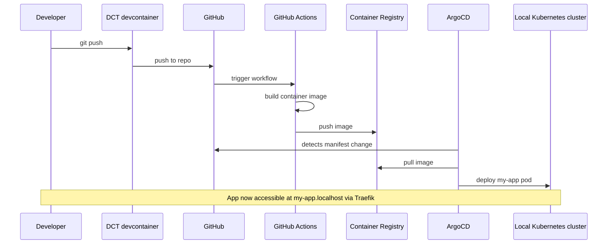

import TemplateHeader from '@site/src/components/TemplateHeader';

<TemplateHeader
  logo="/img/templates/php-basic-webserver-logo.svg"
  name="PHP Basic Webserver"
  version="1.0.0"
  description="PHP web server using built-in server with health endpoint and Docker support"
  install="dev-template php-basic-webserver"
  links={[{"url":"https://github.com/helpers-no/dev-templates/tree/main/templates/php-basic-webserver","title":"Source code","icon":"github"}]}
  maintainers={["terchris"]}
  tags={["php","webserver","api","rest"]}
  tools="dev-php-laravel"
/>


A minimal PHP web server using PHP's built-in server with a health check endpoint. Includes Docker containerization, Kubernetes deployment manifests, and GitHub Actions CI/CD workflow.

import TemplateEnvironment from '@site/src/components/TemplateEnvironment';

<TemplateEnvironment
  requires={null}
  params={{"app_name":"my-app"}}
  quickstart={{"title":"Run the PHP server","setup":[],"run":"php -S 0.0.0.0:3000 -t public","note":"PHP's built-in server runs on port 3000. VS Code auto-forwards the port.\n"}}
  tools={[{"id":"dev-php-laravel","name":"PHP Laravel Development Tools","description":"Installs PHP 8.4, Composer, Laravel installer, and sets up Laravel development environment","website":"https://laravel.com","docsUrl":"https://dct.sovereignsky.no/docs/tools/development-tools/php-laravel"}]}
  services={[]}
  templateKind={"app"}
  initFiles={{}}
  configureCommand={null}
  templateInfoYaml={null}
  expectedOutputBlock={null}
/>


## Prerequisites

- [ ] [DCT devcontainer running](https://dct.sovereignsky.no)


<div className="templateCard">
<div className="templateCardEyebrow">ARCHITECTURE</div>

## Architecture

These diagrams are auto-generated from the template's metadata. Click any diagram to enlarge.

### Deployment

<details className="dropdownBlock">
<summary>Components</summary>



</details>

<details className="dropdownBlock">
<summary>Flow</summary>



</details>

</div>

A minimal PHP web server using PHP's built-in server. Displays "Hello World" with current time and date, and provides health check endpoints.

## Quick Start

1. Update your terminal (tools were installed):
   ```bash
   source ~/.bashrc
   ```

2. Run the app:
   ```bash
   php -S 0.0.0.0:3000 app/index.php
   ```

3. Open in browser: http://localhost:3000

## Prerequisites

Development tools are installed automatically by the devcontainer.
If you need to reinstall, run: `dev-setup`

## Project Structure

After installation, your project contains:

```plaintext
├── app/
│   └── index.php                          # Main application
├── manifests/
│   ├── deployment.yaml                    # K8s Deployment + Service
│   └── kustomization.yaml                 # ArgoCD configuration
├── .github/
│   └── workflows/
│       └── urbalurba-build-and-push.yaml  # CI/CD pipeline
├── Dockerfile                             # Container build (multi-stage)
├── TEMPLATE_INFO                          # Template metadata
└── README-php-basic-webserver.md          # This file
```

## Development

- Edit `app/index.php` — the main application file
- The `/` endpoint returns "Hello World" with the template name and current time/date
- Restart the server after changes (PHP's built-in server does not auto-reload)

## Docker Build

```bash
docker build -t php-basic-webserver .
docker run -p 3000:3000 php-basic-webserver
```

## Kubernetes Deployment

```bash
kubectl apply -k manifests/
```

The app will be accessible at `http://<app-name>.localhost` after ArgoCD registration.

## CI/CD

The GitHub Actions workflow automatically builds and pushes the Docker image to GitHub Container Registry when changes are pushed to the main branch.

---

## Related Templates

- [Python Basic Webserver](../basic-web-server/python-basic-webserver)
- [TypeScript Basic Webserver](../basic-web-server/typescript-basic-webserver)

