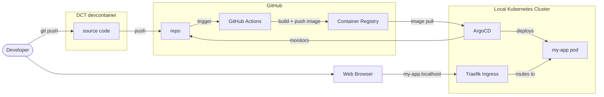
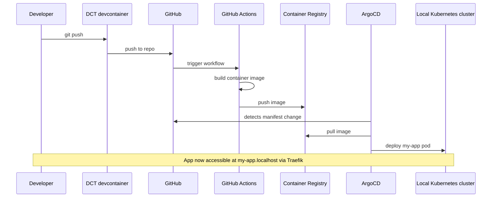

import TemplateHeader from '@site/src/components/TemplateHeader';

<TemplateHeader
  logo="/img/templates/typescript-basic-webserver-logo.svg"
  name="TypeScript Basic Webserver"
  version="1.0.0"
  description="Express.js server with TypeScript, health endpoint, and Docker support"
  install="dev-template typescript-basic-webserver"
  links={[{"url":"https://github.com/helpers-no/dev-templates/tree/main/templates/typescript-basic-webserver","title":"Source code","icon":"github"}]}
  maintainers={["terchris"]}
  tags={["typescript","express","webserver","api","rest"]}
  tools="dev-typescript"
/>


A minimal Express.js web server written in TypeScript with hot reload via nodemon. Includes Docker containerization, Kubernetes deployment manifests, and GitHub Actions CI/CD workflow.

import TemplateEnvironment from '@site/src/components/TemplateEnvironment';

<TemplateEnvironment
  requires={null}
  params={{"app_name":"my-app"}}
  quickstart={{"title":"Run the Express server","setup":["npm install"],"run":"npm run dev","note":"Server runs on port 3000 with hot reload via nodemon. VS Code auto-forwards the port.\n"}}
  tools={[{"id":"dev-typescript","name":"TypeScript Development Tools","description":"Adds TypeScript and development tools (Node.js already in devcontainer)","website":"https://www.typescriptlang.org","docsUrl":"https://dct.sovereignsky.no/docs/tools/development-tools/typescript"}]}
  services={[]}
  templateKind={"app"}
  initFiles={{}}
  configureCommand={null}
/>


## Prerequisites

- [ ] [DCT devcontainer running](https://dct.sovereignsky.no)


## Architecture

### Deployment





A minimal Express.js web server written in TypeScript. Displays "Hello World" and demonstrates deployment to Kubernetes via ArgoCD and GitHub Actions.

## Quick Start

1. Update your terminal (tools were installed):
   ```bash
   source ~/.bashrc
   ```

2. Install dependencies and run:
   ```bash
   npm install
   npm run dev
   ```

3. Open in browser: http://localhost:3000

The server auto-reloads on file changes via nodemon.

## Prerequisites

Development tools are installed automatically by the devcontainer.
If you need to reinstall, run: `dev-setup`

## Project Structure

After installation, your project contains:

```plaintext
├── app/
│   └── index.ts                           # Express server with Hello World
├── manifests/
│   ├── deployment.yaml                    # K8s Deployment + Service
│   └── kustomization.yaml                 # ArgoCD configuration
├── .github/
│   └── workflows/
│       └── urbalurba-build-and-push.yaml  # CI/CD pipeline
├── Dockerfile                             # Container build
├── package.json                           # Node.js dependencies
├── tsconfig.json                          # TypeScript configuration
├── TEMPLATE_INFO                          # Template metadata
└── README-typescript-basic-webserver.md   # This file
```

## Development

- Edit `app/index.ts` — the main Express server
- Changes auto-reload via nodemon (`npm run dev`)
- The `/` endpoint returns "Hello World"

## Docker Build

```bash
docker build -t typescript-basic-webserver .
docker run -p 3000:3000 typescript-basic-webserver
```

## Kubernetes Deployment

```bash
kubectl apply -k manifests/
```

The app will be accessible at `http://<app-name>.localhost` after ArgoCD registration.

## CI/CD

The GitHub Actions workflow automatically builds and pushes the Docker image to GitHub Container Registry when changes are pushed to the main branch.

---

## Related Templates

- [Designsystemet Basic React App](../web-app/designsystemet-basic-react-app)
- [Python Basic Webserver](../basic-web-server/python-basic-webserver)

