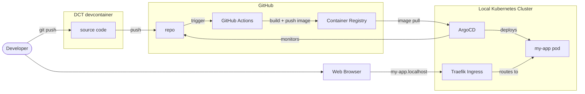
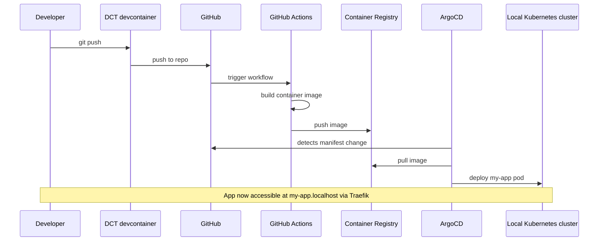

import TemplateHeader from '@site/src/components/TemplateHeader';

<TemplateHeader
  logo="/img/templates/designsystemet-basic-react-app-logo.svg"
  name="Designsystemet Basic React App"
  version="1.0.0"
  description="React app with Designsystemet components, Vite, and TypeScript"
  abstract={"A React application using Designsystemet from Digdir with blog cards, Vite for development, and TypeScript support. Includes Docker containerization, Kubernetes deployment manifests, and GitHub Actions CI/CD workflow."}
  install="dev-template designsystemet-basic-react-app"
  links={[{"url":"https://github.com/helpers-no/dev-templates/tree/main/templates/designsystemet-basic-react-app","title":"Source code","icon":"github"}]}
  maintainers={["terchris"]}
  tags={["react","typescript","vite","designsystemet","digdir","webapp"]}
  tools="dev-typescript"
/>

GETTING STARTED

### Prerequisites

- [ ] [DCT devcontainer running](https://dct.sovereignsky.no)

### Files

Files (30)

<pre className="filesTree">
├── <a href="https://github.com/helpers-no/dev-templates/blob/main/templates/designsystemet-basic-react-app/.dockerignore" target="_blank" rel="noopener noreferrer">.dockerignore</a>
├── <a href="https://github.com/helpers-no/dev-templates/blob/main/templates/designsystemet-basic-react-app/.gitignore" target="_blank" rel="noopener noreferrer">.gitignore</a>
├── <a href="https://github.com/helpers-no/dev-templates/blob/main/templates/designsystemet-basic-react-app/Dockerfile" target="_blank" rel="noopener noreferrer">Dockerfile</a>
├── <a href="https://github.com/helpers-no/dev-templates/blob/main/templates/designsystemet-basic-react-app/eslint.config.js" target="_blank" rel="noopener noreferrer">eslint.config.js</a>
├── <a href="https://github.com/helpers-no/dev-templates/blob/main/templates/designsystemet-basic-react-app/index.html" target="_blank" rel="noopener noreferrer">index.html</a>
├── <a href="https://github.com/helpers-no/dev-templates/blob/main/templates/designsystemet-basic-react-app/package.json" target="_blank" rel="noopener noreferrer">package.json</a>
├── <a href="https://github.com/helpers-no/dev-templates/blob/main/templates/designsystemet-basic-react-app/README-designsystemet-basic-react-app.md" target="_blank" rel="noopener noreferrer">README-designsystemet-basic-react-app.md</a>
├── <a href="https://github.com/helpers-no/dev-templates/blob/main/templates/designsystemet-basic-react-app/template-info.yaml" target="_blank" rel="noopener noreferrer">template-info.yaml</a>
├── <a href="https://github.com/helpers-no/dev-templates/blob/main/templates/designsystemet-basic-react-app/tsconfig.app.json" target="_blank" rel="noopener noreferrer">tsconfig.app.json</a>
├── <a href="https://github.com/helpers-no/dev-templates/blob/main/templates/designsystemet-basic-react-app/tsconfig.json" target="_blank" rel="noopener noreferrer">tsconfig.json</a>
├── <a href="https://github.com/helpers-no/dev-templates/blob/main/templates/designsystemet-basic-react-app/tsconfig.node.json" target="_blank" rel="noopener noreferrer">tsconfig.node.json</a>
├── <a href="https://github.com/helpers-no/dev-templates/blob/main/templates/designsystemet-basic-react-app/vite.config.ts" target="_blank" rel="noopener noreferrer">vite.config.ts</a>
├── .github/
│   └── workflows/
│       └── <a href="https://github.com/helpers-no/dev-templates/blob/main/templates/designsystemet-basic-react-app/.github/workflows/urbalurba-build-and-push.yaml" target="_blank" rel="noopener noreferrer">urbalurba-build-and-push.yaml</a>
├── doc/
│   └── <a href="https://github.com/helpers-no/dev-templates/blob/main/templates/designsystemet-basic-react-app/doc/screenshot.png" target="_blank" rel="noopener noreferrer">screenshot.png</a>
├── manifests/
│   ├── <a href="https://github.com/helpers-no/dev-templates/blob/main/templates/designsystemet-basic-react-app/manifests/deployment.yaml" target="_blank" rel="noopener noreferrer">deployment.yaml</a>
│   └── <a href="https://github.com/helpers-no/dev-templates/blob/main/templates/designsystemet-basic-react-app/manifests/kustomization.yaml" target="_blank" rel="noopener noreferrer">kustomization.yaml</a>
├── public/
│   ├── <a href="https://github.com/helpers-no/dev-templates/blob/main/templates/designsystemet-basic-react-app/public/vite.svg" target="_blank" rel="noopener noreferrer">vite.svg</a>
│   └── images/
│       ├── <a href="https://github.com/helpers-no/dev-templates/blob/main/templates/designsystemet-basic-react-app/public/images/accessible-components.webp" target="_blank" rel="noopener noreferrer">accessible-components.webp</a>
│       ├── <a href="https://github.com/helpers-no/dev-templates/blob/main/templates/designsystemet-basic-react-app/public/images/creating-custom-themes.webp" target="_blank" rel="noopener noreferrer">creating-custom-themes.webp</a>
│       └── <a href="https://github.com/helpers-no/dev-templates/blob/main/templates/designsystemet-basic-react-app/public/images/exploring-designsystemet.webp" target="_blank" rel="noopener noreferrer">exploring-designsystemet.webp</a>
├── scripts/
│   └── <a href="https://github.com/helpers-no/dev-templates/blob/main/templates/designsystemet-basic-react-app/scripts/optimize-images.sh" target="_blank" rel="noopener noreferrer">optimize-images.sh</a>
└── src/
    ├── <a href="https://github.com/helpers-no/dev-templates/blob/main/templates/designsystemet-basic-react-app/src/App.css" target="_blank" rel="noopener noreferrer">App.css</a>
    ├── <a href="https://github.com/helpers-no/dev-templates/blob/main/templates/designsystemet-basic-react-app/src/App.tsx" target="_blank" rel="noopener noreferrer">App.tsx</a>
    ├── <a href="https://github.com/helpers-no/dev-templates/blob/main/templates/designsystemet-basic-react-app/src/index.css" target="_blank" rel="noopener noreferrer">index.css</a>
    ├── <a href="https://github.com/helpers-no/dev-templates/blob/main/templates/designsystemet-basic-react-app/src/main.tsx" target="_blank" rel="noopener noreferrer">main.tsx</a>
    ├── <a href="https://github.com/helpers-no/dev-templates/blob/main/templates/designsystemet-basic-react-app/src/vite-env.d.ts" target="_blank" rel="noopener noreferrer">vite-env.d.ts</a>
    ├── components/
    │   └── BlogCard/
    │       ├── <a href="https://github.com/helpers-no/dev-templates/blob/main/templates/designsystemet-basic-react-app/src/components/BlogCard/BlogCard.module.css" target="_blank" rel="noopener noreferrer">BlogCard.module.css</a>
    │       └── <a href="https://github.com/helpers-no/dev-templates/blob/main/templates/designsystemet-basic-react-app/src/components/BlogCard/BlogCard.tsx" target="_blank" rel="noopener noreferrer">BlogCard.tsx</a>
    ├── data/
    │   └── <a href="https://github.com/helpers-no/dev-templates/blob/main/templates/designsystemet-basic-react-app/src/data/blog-posts.json" target="_blank" rel="noopener noreferrer">blog-posts.json</a>
    └── types/
        └── <a href="https://github.com/helpers-no/dev-templates/blob/main/templates/designsystemet-basic-react-app/src/types/BlogPost.ts" target="_blank" rel="noopener noreferrer">BlogPost.ts</a>
</pre>

### Related templates

- [TypeScript Basic Webserver](../basic-web-server/typescript-basic-webserver)

import TemplateEnvironment from '@site/src/components/TemplateEnvironment';

<TemplateEnvironment
  requires={null}
  params={{"app_name":"my-app"}}
  quickstart={{"title":"Run the Vite dev server","setup":["npm install"],"run":"npm run dev","note":"Vite runs on port 5173. VS Code auto-forwards the port — click the globe icon in the Ports tab.\n"}}
  tools={[{"id":"dev-typescript","name":"TypeScript Development Tools","description":"Adds TypeScript and development tools (Node.js already in devcontainer)","website":"https://www.typescriptlang.org","docsUrl":"https://dct.sovereignsky.no/docs/tools/development-tools/typescript"}]}
  services={[]}
  templateKind={"app"}
  initFiles={{}}
  configureCommand={null}
  templateInfoYaml={null}
  expectedOutputBlock={null}
/>

ARCHITECTURE

## Architecture

These diagrams are auto-generated from the template's metadata. Click any diagram to enlarge.

### Deployment

Components

<a href="https://mermaid.live/edit#base64:eyJjb2RlIjoiZmxvd2NoYXJ0IExSXG4gICAgZGV2KFtcIkRldmVsb3BlclwiXSlcbiAgICBicm93c2VyW1wiV2ViIEJyb3dzZXJcIl1cblxuICAgIHN1YmdyYXBoIGRjdFtcIkRDVCBkZXZjb250YWluZXJcIl1cbiAgICAgICAgc3JjW1wic291cmNlIGNvZGVcIl1cbiAgICBlbmRcblxuICAgIHN1YmdyYXBoIGdoW1wiR2l0SHViXCJdXG4gICAgICAgIHJlcG9bXCJyZXBvXCJdXG4gICAgICAgIGFjdGlvbnNbXCJHaXRIdWIgQWN0aW9uc1wiXVxuICAgICAgICBnaGNyW1wiQ29udGFpbmVyIFJlZ2lzdHJ5XCJdXG4gICAgZW5kXG5cbiAgICBzdWJncmFwaCBrOHNbXCJMb2NhbCBLdWJlcm5ldGVzIENsdXN0ZXJcIl1cbiAgICAgICAgdHJhZWZpa1tcIlRyYWVmaWsgSW5ncmVzc1wiXVxuICAgICAgICBhcmdvW1wiQXJnb0NEXCJdXG4gICAgICAgIHBvZFtcIm15LWFwcCBwb2RcIl1cbiAgICBlbmRcblxuICAgIGRldiAtLT58Z2l0IHB1c2h8IHNyY1xuICAgIHNyYyAtLT58cHVzaHwgcmVwb1xuICAgIHJlcG8gLS0+fHRyaWdnZXJ8IGFjdGlvbnNcbiAgICBhY3Rpb25zIC0tPnxidWlsZCArIHB1c2ggaW1hZ2V8IGdoY3JcbiAgICBhcmdvIC0tPnxtb25pdG9yc3wgcmVwb1xuICAgIGdoY3IgLS0+fGltYWdlIHB1bGx8IGFyZ29cbiAgICBhcmdvIC0tPnxkZXBsb3lzfCBwb2RcbiAgICB0cmFlZmlrIC0tPnxyb3V0ZXMgdG98IHBvZFxuICAgIGJyb3dzZXIgLS0+fG15LWFwcC5sb2NhbGhvc3R8IHRyYWVmaWtcbiAgICBkZXYgLS0+IGJyb3dzZXIiLCJtZXJtYWlkIjoie1widGhlbWVcIjpcImRlZmF1bHRcIn0ifQ==" target="_blank" rel="noopener noreferrer" className="mermaidLiveLink">↗ Open in mermaid.live</a>

Flow

<a href="https://mermaid.live/edit#base64:eyJjb2RlIjoic2VxdWVuY2VEaWFncmFtXG4gICAgcGFydGljaXBhbnQgRGV2IGFzIERldmVsb3BlclxuICAgIHBhcnRpY2lwYW50IERDVCBhcyBEQ1QgZGV2Y29udGFpbmVyXG4gICAgcGFydGljaXBhbnQgR0ggYXMgR2l0SHViXG4gICAgcGFydGljaXBhbnQgQWN0aW9ucyBhcyBHaXRIdWIgQWN0aW9uc1xuICAgIHBhcnRpY2lwYW50IEdIQ1IgYXMgQ29udGFpbmVyIFJlZ2lzdHJ5XG4gICAgcGFydGljaXBhbnQgQXJnbyBhcyBBcmdvQ0RcbiAgICBwYXJ0aWNpcGFudCBLOHMgYXMgTG9jYWwgS3ViZXJuZXRlcyBjbHVzdGVyXG4gICAgRGV2LT4+RENUOiBnaXQgcHVzaFxuICAgIERDVC0+PkdIOiBwdXNoIHRvIHJlcG9cbiAgICBHSC0+PkFjdGlvbnM6IHRyaWdnZXIgd29ya2Zsb3dcbiAgICBBY3Rpb25zLT4+QWN0aW9uczogYnVpbGQgY29udGFpbmVyIGltYWdlXG4gICAgQWN0aW9ucy0+PkdIQ1I6IHB1c2ggaW1hZ2VcbiAgICBBcmdvLT4+R0g6IGRldGVjdHMgbWFuaWZlc3QgY2hhbmdlXG4gICAgQXJnby0+PkdIQ1I6IHB1bGwgaW1hZ2VcbiAgICBBcmdvLT4+SzhzOiBkZXBsb3kgbXktYXBwIHBvZFxuICAgIE5vdGUgb3ZlciBEZXYsSzhzOiBBcHAgbm93IGFjY2Vzc2libGUgYXQgbXktYXBwLmxvY2FsaG9zdCB2aWEgVHJhZWZpayIsIm1lcm1haWQiOiJ7XCJ0aGVtZVwiOlwiZGVmYXVsdFwifSJ9" target="_blank" rel="noopener noreferrer" className="mermaidLiveLink">↗ Open in mermaid.live</a>

## Template README

The Designsystemet Basic React App template is a React app that demonstrates how to use the Norwegian government design system (Designsystemet) to build a styled web application.
The purpose of this app is to verify that the development environment is set up and to provide a starting point for apps that use the Designsystemet component library.
See more documentation at http://localhost:3000/docs/templates/web-app/designsystemet-basic-react-app

## What it renders

- **`src/App.tsx`** — page shell: headings and a grid of blog cards.
- **`src/components/BlogCard/BlogCard.tsx`** — each post using Designsystemet **Card**, **Heading**, **Paragraph** (`@digdir/designsystemet-react`).
- **`src/data/blog-posts.json`** — post list consumed by `App` (shape matches **`src/types/BlogPost.ts`**).
- **`src/main.tsx`** — Vite/React entry; imports global CSS and themes.

Static assets for posts live under **`public/`** (paths referenced from the JSON).

## Dev server

- **Run:** `npm install` then `npm run dev` (Vite HMR on file changes).
- Default dev URL is shown in the terminal (typically **http://localhost:3000** unless the port is taken).

## Changing the app

- Edit copy and layout in **`App.tsx`**; adjust card styling in **`BlogCard.tsx`** / **`BlogCard.module.css`**.
- Add or edit posts in **`src/data/blog-posts.json`** and place images under **`public/`** as needed.

