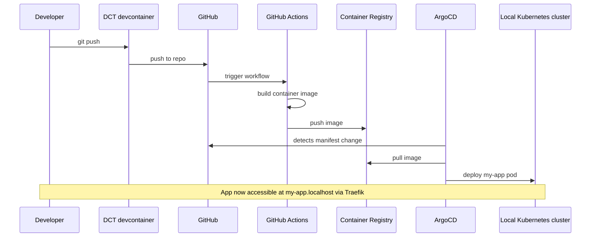

import TemplateHeader from '@site/src/components/TemplateHeader';

<TemplateHeader
  logo="/img/templates/designsystemet-basic-react-app-logo.svg"
  name="Designsystemet Basic React App"
  version="1.0.0"
  description="React app with Designsystemet components, Vite, and TypeScript"
  install="dev-template designsystemet-basic-react-app"
  links={[{"url":"https://github.com/helpers-no/dev-templates/tree/main/templates/designsystemet-basic-react-app","title":"Source code","icon":"github"}]}
  maintainers={["terchris"]}
  tags={["react","typescript","vite","designsystemet","digdir","webapp"]}
  tools="dev-typescript"
/>


A React application using Designsystemet from Digdir with blog cards, Vite for development, and TypeScript support. Includes Docker containerization, Kubernetes deployment manifests, and GitHub Actions CI/CD workflow.

import TemplateEnvironment from '@site/src/components/TemplateEnvironment';

<TemplateEnvironment
  requires={null}
  params={{"app_name":"my-app"}}
  quickstart={{"title":"Run the Vite dev server","setup":["npm install"],"run":"npm run dev","note":"Vite runs on port 5173. VS Code auto-forwards the port — click the globe icon in the Ports tab.\n"}}
  tools={[{"id":"dev-typescript","name":"TypeScript Development Tools","description":"Adds TypeScript and development tools (Node.js already in devcontainer)","website":"https://www.typescriptlang.org","docsUrl":"https://dct.sovereignsky.no/docs/tools/development-tools/typescript"}]}
  services={[]}
  templateKind={"app"}
  initFiles={{}}
  configureCommand={null}
/>


## Prerequisites

- [ ] [DCT devcontainer running](https://dct.sovereignsky.no)


## Architecture

### Deployment




A React application using [Designsystemet](https://designsystemet.no/) from Digdir. Displays a blog page with cards using Designsystemet components, built with Vite and TypeScript.

## Quick Start

1. Update your terminal (tools were installed):
   ```bash
   source ~/.bashrc
   ```

2. Install dependencies and run:
   ```bash
   npm install
   npm run dev
   ```

3. Open in browser: http://localhost:3000

The dev server auto-reloads on file changes via Vite.

## Prerequisites

Development tools are installed automatically by the devcontainer.
If you need to reinstall, run: `dev-setup`

## Project Structure

After installation, your project contains:

```plaintext
├── app/
│   ├── App.tsx                            # Main application component
│   ├── App.css                            # Application styles
│   ├── main.tsx                           # Entry point
│   ├── components/
│   │   └── BlogCard/
│   │       ├── BlogCard.tsx               # Blog card component
│   │       └── BlogCard.css
│   ├── data/
│   │   └── BlogPosts.json                 # Blog post data
│   └── types/
│       └── Blog.ts                        # TypeScript types
├── public/
│   └── images/                            # Blog post images
├── manifests/
│   ├── deployment.yaml                    # K8s Deployment + Service
│   └── kustomization.yaml                 # ArgoCD configuration
├── .github/
│   └── workflows/
│       └── urbalurba-build-and-push.yaml  # CI/CD pipeline
├── Dockerfile                             # Container build
├── index.html
├── package.json                           # Node.js dependencies
├── tsconfig.json                          # TypeScript configuration
├── vite.config.ts                         # Vite configuration
├── TEMPLATE_INFO                          # Template metadata
└── README-designsystemet-basic-react-app.md  # This file
```

## Development

- Edit `app/App.tsx` — the main application component
- Edit `app/data/BlogPosts.json` — add or modify blog posts
- Edit `app/components/BlogCard/BlogCard.tsx` — customise the card component
- Uses Designsystemet React components (Card, Heading, Paragraph)
- Changes auto-reload via Vite HMR

## Docker Build

```bash
docker build -t designsystemet-basic-react-app .
docker run -p 3000:3000 designsystemet-basic-react-app
```

## Kubernetes Deployment

```bash
kubectl apply -k manifests/
```

The app will be accessible at `http://<app-name>.localhost` after ArgoCD registration.

## CI/CD

The GitHub Actions workflow automatically builds and pushes the Docker image to GitHub Container Registry when changes are pushed to the main branch.

---

## Related Templates

- [TypeScript Basic Webserver](../basic-web-server/typescript-basic-webserver)

